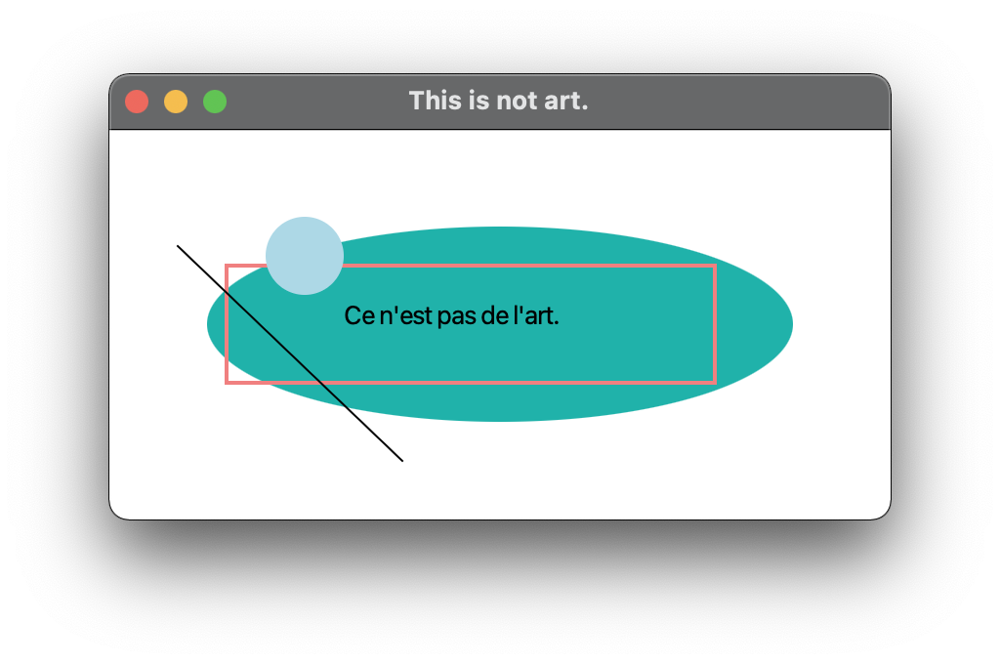
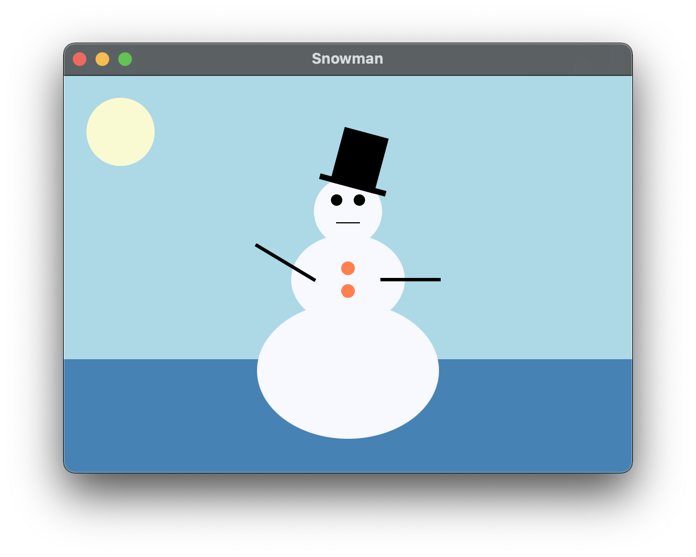

## Lectures 07, etc.

# Graphics with JavaFX

### 12 Messidor, Year CCXXX

### Sections

1. [**Groups, scenes, shapes, and colours**](#part-1-examples-from-lecture-1)

### Part 1: _Groups, scenes, shapes, and colours_

1. [**Hello JavaFX!**](HelloJavaFX.java)
   1. The origin of the Java coordinate system is in the upper left corner.
   2. Meaning that all coordinates in Java are positive. 
2. [**Ce n'est pas de l'art**](NotArt.java)
   1. JavaFX shapes are represented by classes in the `javafx.scene.shape` package.
   2. A line segment is defined by the `Line` class, whose constructor accepts the coordinates of the two endpoints.
   3. A rectangle is specified by its upper left corner and its width and height.
   4. A circle is specified by its center point and radius.
   5. An ellipse is specified by its center point and its radius along the x- and y-axis.
   6. Shapes are drawn in the order in which they are added to the group. 
3. [**Snowman**](Snowman.java)
   1. Groups can be nested within groups.
   2. _Translating_ a shape or group shifts its position along the x- or y-axis.
   3. A shape or group can be rotated using the `setRotate()` method. 
4. **Representing Colour**:
   1. A color in Java is represented by a `Color` object.
   2. A color object holds three numbers called an [**RGB value**](https://en.wikipedia.org/wiki/RGB_color_model), which
   stands for Red-Green-Blue.
   3. Each number represents the contribution of that color.
   4. Each number in an RGB value is in the range 0 to 255.
   5. For convenience, several `Color` objects have been predefined, such as:
      1. **`Color.BLACK`**: 0, 0, 0.
      2. **`Color.WHITE`**: 255, 255, 255.
      3. **`Color.RED`**: 255, 0, 0.
      4. **`Color.YELLOW`**: 255, 255, 0.
      5. **`Color.CYAN`**: 0, 255, 255.
      6. **`Color.PINK`**: 255, 192, 203.
      7. **`Color.GRAY`**: 128, 128, 128.
   6. The static `rgb()` method in the `Color` class returns a `Color` object with a specific RGB value: 
   `Color purple = Color.rgb(183, 44, 150);`.
   7. The colormethod uses [**percentages**](https://www.december.com/html/spec/colorper.html): `Color maroon = 
   Color.color(0.6, 0.1, 0.0);`.