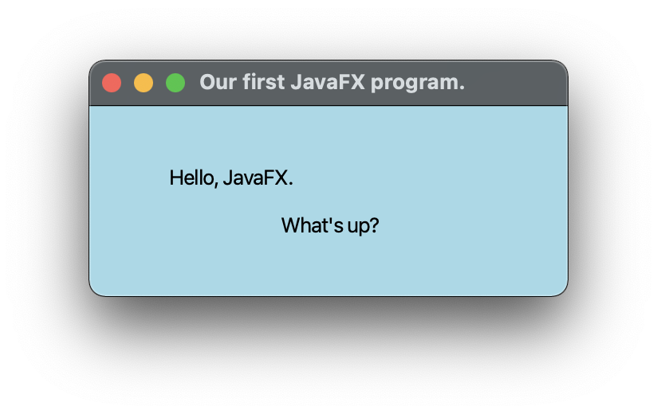

## Lectures 07, etc.

# Graphics with JavaFX

### 12 Messidor, Year CCXXX

### Sections

1. [**Groups, scenes, shapes, and colours**](#part-1-examples-from-lecture-1)
2. [**Graphical User Interfaces (GUI)**](#part-2-graphical-user-interfaces-gui)

### Part 1: _Groups, scenes, shapes, and colours_

1. [**Hello JavaFX!**](HelloJavaFX.java)
   1. The origin of the Java coordinate system is in the upper left corner.
   2. Meaning that all coordinates in Java are positive. 
2. [**Ce n'est pas de l'art**](NotArt.java)
   1. JavaFX shapes are represented by classes in the `javafx.scene.shape` package.
   2. A line segment is defined by the `Line` class, whose constructor accepts the coordinates of the two endpoints.
   3. A rectangle is specified by its upper left corner and its width and height.
   4. A circle is specified by its center point and radius.
   5. An ellipse is specified by its center point and its radius along the x- and y-axis.
   6. Shapes are drawn in the order in which they are added to the group. 
3. [**Snowman**](Snowman.java)
   1. Groups can be nested within groups.
   2. _Translating_ a shape or group shifts its position along the x- or y-axis.
   3. A shape or group can be rotated using the `setRotate()` method. 
4. **Representing Colour**:
   1. A color in Java is represented by a `Color` object.
   2. A color object holds three numbers called an [**RGB value**](https://en.wikipedia.org/wiki/RGB_color_model), which
   stands for Red-Green-Blue.
   3. Each number represents the contribution of that color.
   4. Each number in an RGB value is in the range 0 to 255.
   5. For convenience, several `Color` objects have been predefined, such as:
      1. **`Color.BLACK`**: 0, 0, 0.
      2. **`Color.WHITE`**: 255, 255, 255.
      3. **`Color.RED`**: 255, 0, 0.
      4. **`Color.YELLOW`**: 255, 255, 0.
      5. **`Color.CYAN`**: 0, 255, 255.
      6. **`Color.PINK`**: 255, 192, 203.
      7. **`Color.GRAY`**: 128, 128, 128.
   6. The static `rgb()` method in the `Color` class returns a `Color` object with a specific RGB value: 
   `Color purple = Color.rgb(183, 44, 150);`.
   7. The colormethod uses [**percentages**](https://www.december.com/html/spec/colorper.html): `Color maroon = 
   Color.color(0.6, 0.1, 0.0);`.

### Part 2: _Graphical User Interfaces (GUI)_

1. [**Push Counter**](PushCounter.java)
   1. A call to the `setOnAction()` method sets up the relationship between the _button_ that generates the event and 
   the _event handler_ that responds to it.
   2. This example uses a method reference (using the `::` operator) to specify the event handler method.
   3. The `this` reference indicates that the event handler method is in the same class.
   4. The event handler method can be called whatever you want, but must accept an `ActionEvent` object as a parameter.
   5. A flow pane is another layout pane, which displays its contents horizontally in rows or vertically in columns.
      1. A gap of 20 pixels is established between elements on a row using the `setHGap()` method.
   6. Instead of using a method reference, the event handler could be specified using a separate class that implements
   [**the `EventHandler` interface**](ButtonHandler.java).
      1. The event handler class could be defined as public in a separate file or as a private inner class in the same 
      file.
      2. The call to the `setOnAction()` method would specify a new event handler object e.g. `push.setOnAction(new 
      ButtonHandler());`.
      3. _Or_ you can use a lambda expression: `(event) -> {statements}`.
   7. Lambda expressions can be used whenever an object of a functional interface (i.e. an interface that contains only 
   methods) is required, and that interface contains a single method.
   8. The `EventHandler` interface is a functional interface, and contains a single method `handle()`.
2. [**Fahrenheit Pane**](FahrenheitPane.java) and [**Fahrenheit Converter**](FahrenheitConverter.java)
   1. A text field allows the user to enter one line of input.
   2. If the cursor is in the text field, the text field object generates an action event when the enter key is pressed.
   3. `GridPaneis` a JavaFX layout pane that displays nodes in a rectangular grid.