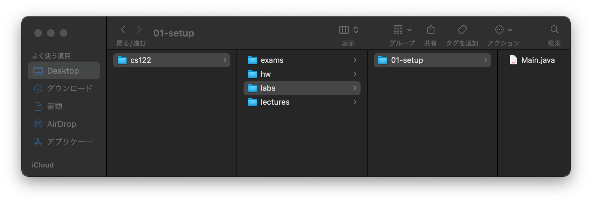
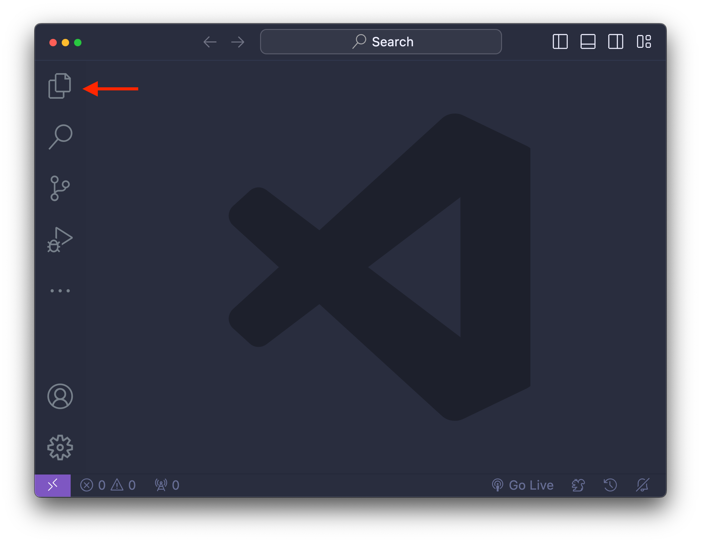
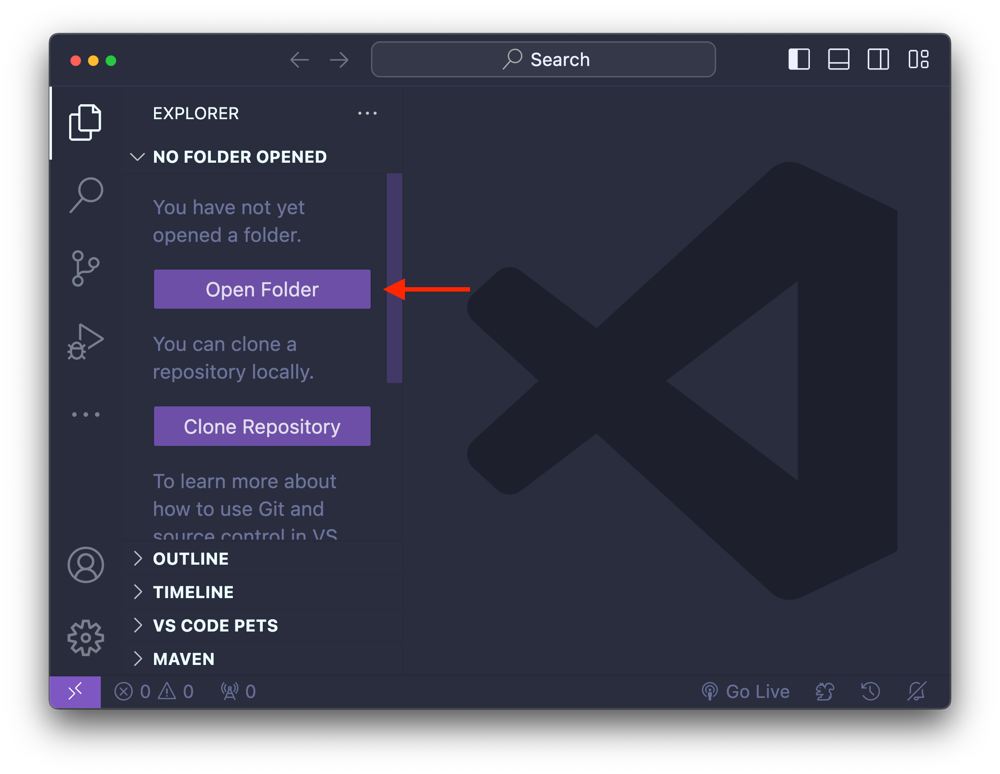
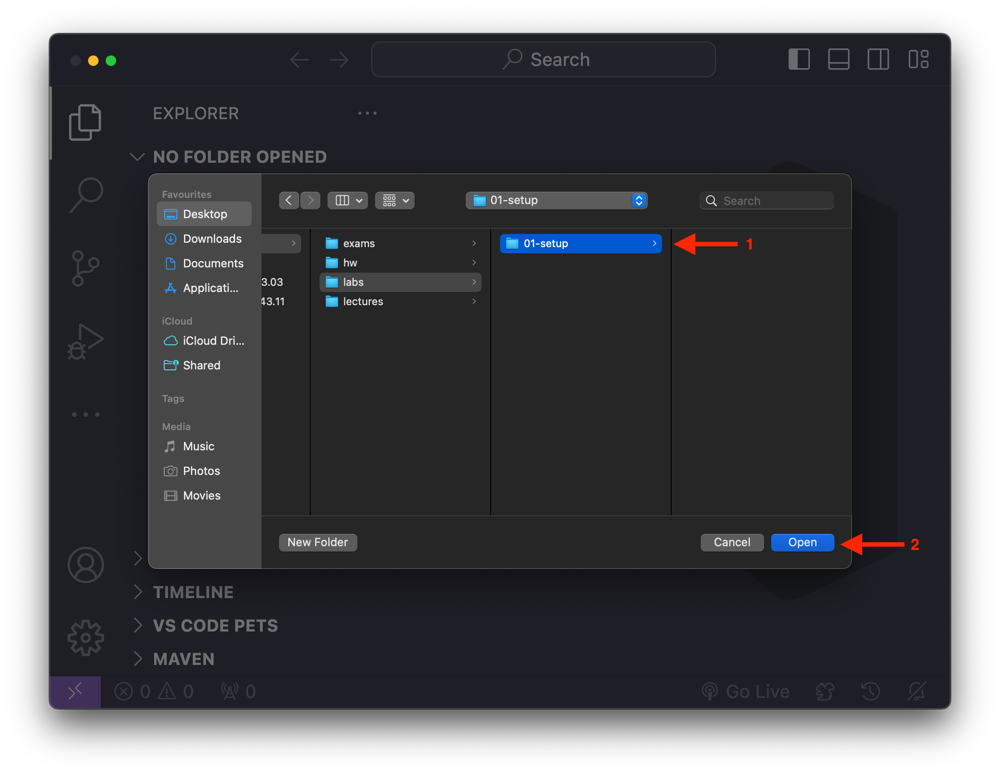
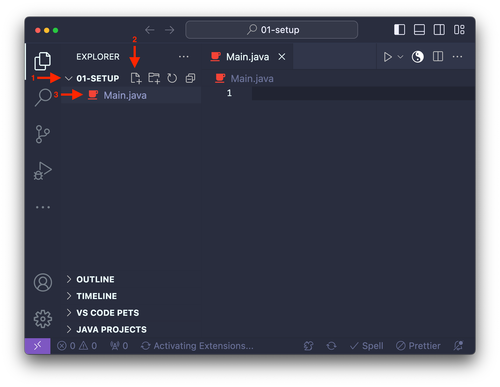
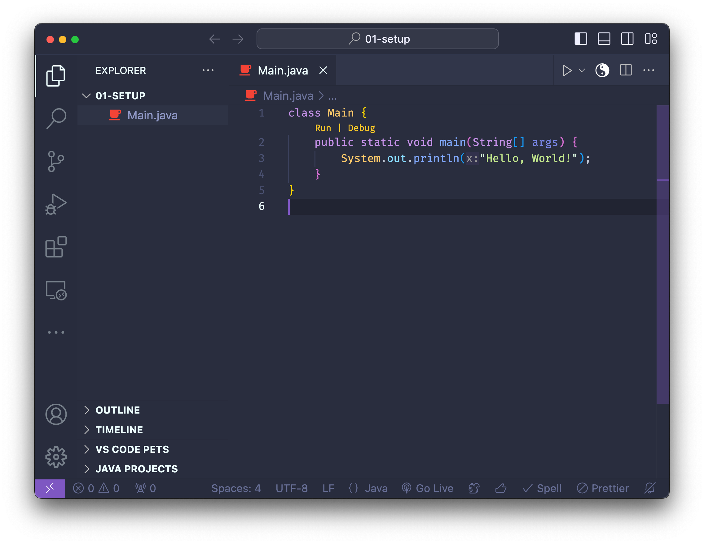
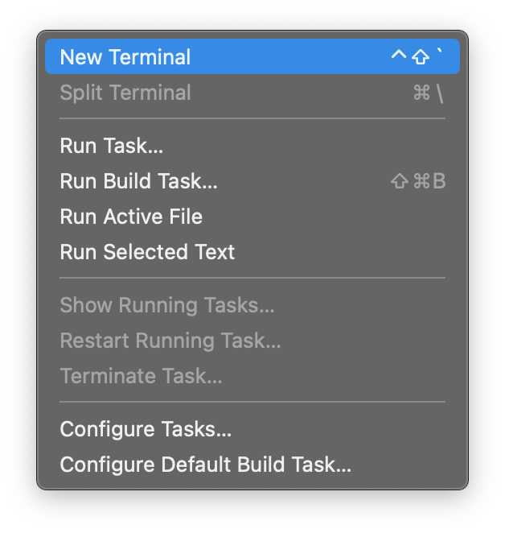
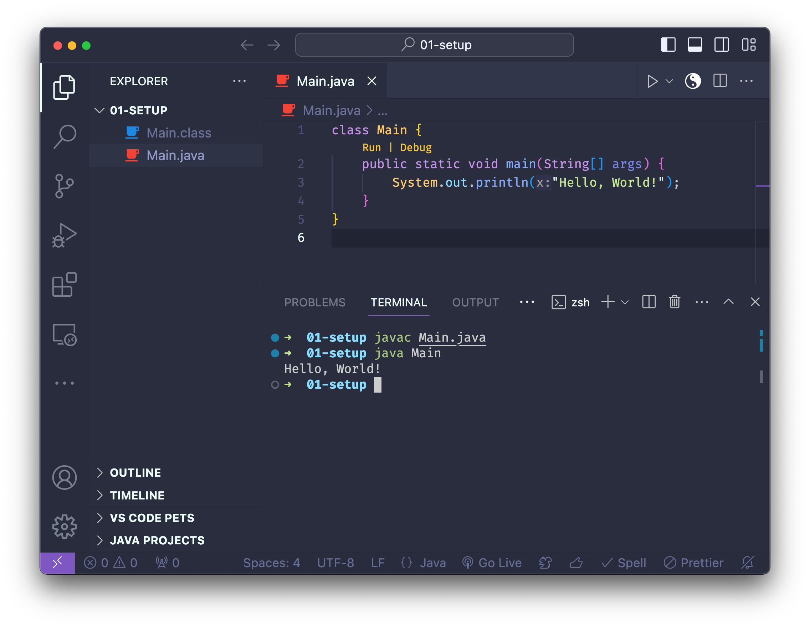
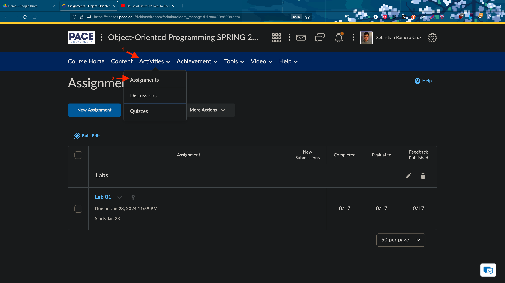

<h2 align=center>Week 01: <em>Day 1</em></h2>

<h1 align=center>Introductions and Syllabus Review</h1>

<p align=center><strong><em>Song of the day</strong>: <a href="https://youtu.be/-UWpbEsj2yA?si=BaUfmDJXznXrC3J7"><strong><u>Sunkissed</u></strong></a> by The Vaccines (2024)</em></p>

### Sections

1. [**Hello, Professor!**](#part-1-textures)
<!-- 2. [**Course Setup (Lab 1)**](#course-setup-lab-1)
    1. [**Create Your Folders For This Class**](#create-your-folders-for-this-class)
    2. [**Setting Up Visual Studio Code**](#setting-up-visual-studio-code)
    3. [**Open VSCode, Create A Java File, And Run It**](#open-vscode-create-a-java-file-and-run-it)
    4. [**What And Where To Submit**](#what-and-where-to-submit) -->


### Hello, Professor!

Hey, my name is Sebastián Romero Cruz, and I will be your instructor for this semester's **Computer Programming II: _Object-Oriented Programming_** class. It's a pleasure meeting some of you for the first time, and it warms my heart to see others again from last semester. Y'all already know how it is, so let's get started. If you are reading these notes, you'll know that I spent a good chunk of time talking about the syllabus, so please refer to that.

There's nothing too much that I want to say about myself that concerns this course too much. Here's some useless data about me, in case you're interested:

- I was born in Mexico City, Mexico.
- I have BSc in chemical engineering (I don't know why, to be honest) and a MSc in computer science, both from NYU.
- I've been teaching programming at various university levels since 2020.
- Outside of programming, I like reading novels, listening and playing music, and watching slice-of-life anime.

Alright, with that out of the way, let's start off simple this week–nothing too crazy.

<!-- ### Course Setup (Lab 1)

#### Create Your Folders For This Class

In order to stay organised in this class, I need everybody to have a simple and well-named folder structure so that you can easily find your files when working in this class. This is **not optional**.

Go ahead and create a folder in your computer (where is up to you) and call it `cs122`. Then, inside of it, create the following sub-folder structure:

```
cs122
├── exams
├── hw
├── labs
│   └── 01-setup
│       └── Main.java (don't create this file yet–we'll do that next)
└── lectures

6 folders, 1 file
```

Or, seen in Mac's finder:



<sub>**Figure 1**: Visual representation of the tree structure above.</sub>

Please don't hesitate to ask me if you have any questions here.

#### Setting Up Visual Studio Code

Unless you prefer any other any other Java IDE (which you are more than welcome to use), you will be using [**Visual Studio Code (VSCode)**](https://code.visualstudio.com/). It's perfectly free, highly customisable, and I basically can't live without it at this point, so you should be in good hands if you decide that that's what you're going to work with this semester.

So, please go ahead and do the following:

1. Install [**(VSCode)**](https://code.visualstudio.com/)
2. Follow this [**tutorial**](https://code.visualstudio.com/docs/java/java-tutorial), and do every step _up until, but not including "Creating a source code file"_.

#### Open VSCode, Create A Java File, And Run It

So, to confirm that your installation went smoothly, and to submit the required files for this lab, please perform the following steps. There might be some slight differences between the Mac interface to the Windows interface, but they shouldn't be too major. Don't hesitate to ask me if anything goes awry.

1. **Open VSCode to your lab 01 folder.**





_You need to be in this folder for step 3 to work._

2. **Create a Java file called `Main.java` and type the "Hello, World!" program below.**




The program is as follows:

```java
class Main {
    public static void main(String[] args) {
        System.out.println("Hello, World!");
    }
}
```

3. **Open a Terminal window in VSCode and enter the following _two_ commands to run your program.**





The commands are as follows:

```bash
javac Main.java
```
```bash
java Main
```

You might notice that, after performing these commands, a file called `Main.class` appeared in your folder. This is perfectly normal, so you can just leave it there.

#### What And Where To Submit

Once you are finished, here are the two things I want you to submit:

- **A screenshot of your `Main.java` file running**, similar to the last screenshot from the previous step.
- **Your actual `Main.java` file**. _Don't_ submit the `Main.class` file.

To submit both files, please go to [**Classes**](https://classes.pace.edu/d2l/home/398609), where you can access the submission portal through **`Activites`** > **`Assignments`**. All labs and homework assignments will be submitted in this same place.

 -->
