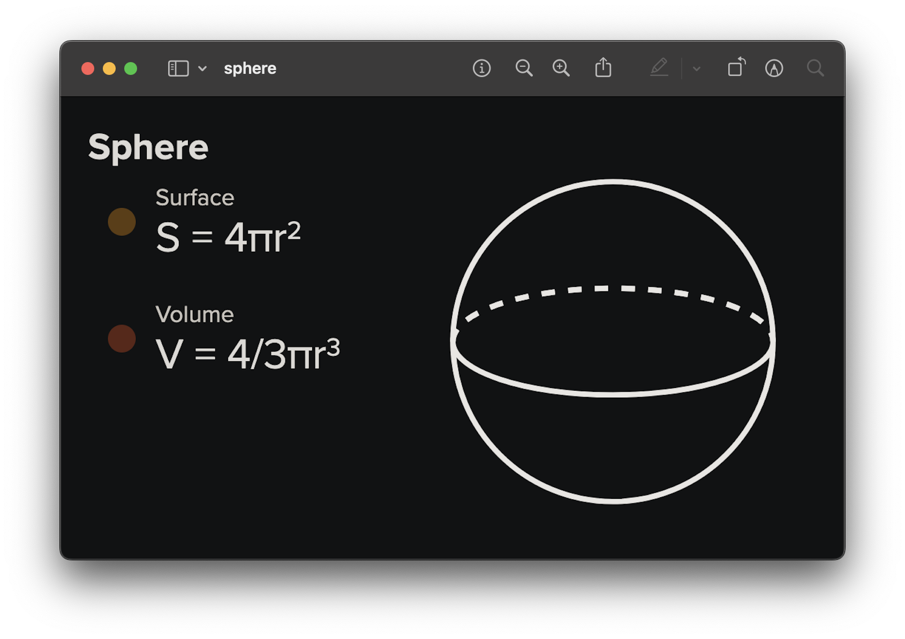

<h2 align=center>Week 02: <em>Day 1</em></h2>

<h1 align=center>Variables and Constants</h1>

<p align=center><strong><em>Song of the day</strong>: <a href="https://youtu.be/4t0xeWFCHho?si=UT042DG2My_mLj86"><strong><u>In The End It Always Does</u></strong></a> by The Japanese House (2023)</em></p>

### Sections

1. [**Our Second (and third, and fourth, and...) Java Program**](#part-1-our-second-and-third-and-fourth-and-java-program)
2. [**Saving Data With Variables**](#part-2-saving-data-with-variables)
3. [**Naming Conventions**](#part-3-naming-conventions)
4. [**Constants**](#part-4-constants)

---

### Part 1: _Our Second (and third, and fourth, and...) Java Program_

Let's practice what we have learned by writing a couple more Java classes. Let's write one that introduced ourselves. I will call mine `NamePrinter`, but you can call it whatever you like:

```java
class NamePrinter {
    public static void main(String[] args) {
        System.out.println("Hello, my name is Sebastián.");
    }
}
```

<sub>**Code Block 4**: A Java [**program**](code/NamePrinter.java) introducing me. Welcome to the future.</sub>

Compiling the `NamePrinter.java` file and running the `NamePrinter.class` bytecode file will result in the following output:

```text
Hello, my name is Sebastián.
```

Nice. Let's try something involving things other than text. Let's write a program that prints the volume of the Earth, whose radius is approximately 6,371,000 metres. Recall, too, the formula for a sphere's volume:



<sub>**Figure 5**: The formula for the volume of a sphere. Here, the character τ (tau) is equivalent to 2π. The Earth is actually an oblate spheroid, by the way. But I'm not doing any of that mess.</sub>

I will call this class `EarthVolumePrinter`:

```java
class EarthVolumePrinter {
    public static void main(String[] args) {
        System.out.println((4.0 / 3.0) * 3.14156 * Math.pow(6371000, 2));
    }
}
```

<sub>**Code Block 5**: A Java [**program**](code/EarthVolumePrinter.java) to display the approximate volume of the Earth.</sub>

Compiling and running will result in the following output:

```text
1.7040051017223984E14
```

Now, there's a number of reasons why the above program is not worth of the name `EarthVolumePrinter`—starting with the fact that it is hard-coded up the up the wazoo—so let's take some steps to fix that.

---

### Part 2: _Saving Data With Variables_

We know this from CS121, but, technically speaking, a variable represents a value store in your computer's memory. When you create a variable, you are basically telling your computer something like this:

> Hey, I want you to store the string `"Sebastián"` inside a memory address. I want you to call this memory address `myName` so I know where I can find this string if I ever need it.

In memory, this might look like this

```text
                |
                |              ~~~~~~~~~~~~~~~
                |               |———————————|
                |        unused | mem_loc a |
  "Sebastián"   |               |———————————|
       |        |        unused | mem_loc b |     
       |        |               |———————————|
       |        |        unused | mem_loc c |
       v        |               |———————————|
     myName ----|------> myName | mem_loc d |
                |               |———————————|
                |        unused | mem_loc e |
                |               |———————————|
                |              ~~~~~~~~~~~~~~~
                |
——————————————————————————————————————————————————
   Programmer                     Computer
```

<sub>**Figure 1**: The memory model of creating a variable called `myName`, which is storing the string value `"Sebastián"`. The identifier `myName` is only for **you** to be able to easily access this value. To your computer, though, this is just memory location d (`memo_loc d`).</sub>

The way you create variables in Java is as follows:
1. You first write the **type** of the _value_ that will be store inside the variable.
2. You then write the **name** of the _variable_.
3. From here, you have the choice of:
    1. Leaving your variable without a value. This is known as ***declaring a variable***. Or...
    2. Assigning an initial value to your variable. This is known as **assignment**. Or...
    3. Both i and ii.

Let's take a look at these steps in action. Numbers with decimals are called "floating-point numbers" in computer science, and you can create one in Java using the `double` keyword. For example, if we wanted to do this with the radius of the Earth (6.3781×10<sup>6</sup>), we would do either of the following:

```java
double radiusOfEarth = 6.3781E6;
```

<sub>**Code Block 4**: Creating a variable called `radiusOfEarth` of type `double` and assigning an initial value of `6.3781E6` to it.</sub>

```java
double radiusOfEarth;
radiusOfEarth = 6.3781E6;
```

<sub>**Code Block 5**: _Declaring_ a variable called `radiusOfEarth` and, later, _assigning_ it a value of `8.988E9`. Note that these are two separate operations.</sub>

In our code, it would look like this:

```java
class EarthVolumePrinter {
    public static void main(String[] args) {
        // Creating a variable called radiusOfEarth and assigning the value 6.3781E6 to it
        double radiusOfEarth = 6.3781E6;

        System.out.println((4.0 / 3.0) * 3.14156 * Math.pow(radiusOfEarth, 2));
    }
}
```

<sub>**Code Block 6**: Our area calculations using our variable `radiusOfEarth`.</sub>

If we looked at the memory model for the creation of this variable, it would look something like this:

```text
                    |
                    |                       ~~~~~~~~~~~~~~~
                    |                        |———————————|
                    |                 unused | mem_loc q |
    6.3781E6        |                        |———————————|
       |            |                 unused | mem_loc r |     
       |            |                        |———————————|
       |            |                 unused | mem_loc s |
       v            |                        |———————————|
 radiusOfEarth -----|--------> radiusOfEarth | mem_loc t |
                    |                        |———————————|
                    |                 unused | mem_loc u |
                    |                        |———————————|
                    |                       ~~~~~~~~~~~~~~~
                    |
—————————————————————————————————————————————————————————
   Programmer                                Computer
```

<sub>**Figure 2**: The memory model of creating a variable called `radiusOfEarth`, which is storing the string value
`6.3781E6`.</sub>

In effect, unless the value of `radiusOfEarth` changes throughout the course of our program, every single time we write `radiusOfEarth`, we will actually be referring to `6.3781E6`.

---

So, while we're at it, let's create variables for the rest of our numbers:

```java
class EarthVolumePrinter {
    public static void main(String[] args) {
        double radiusOfEarth = 6.3781E6;
        double pi = 3.14159;

        System.out.println("The area of the Earth is:");
        System.out.println((4.0 / 3.0) * pi * Math.pow(radiusOfEarth, 2));
    }
}
```

And why stop there? Why don't we create a variable called `areaOfEarth` that stores the **result** of our mathematical operation?

```java
class EarthVolumePrinter {
    public static void main(String[] args) {
        // Step 1: Define our variables
        double radiusOfEarth = 6.3781E6;
        double pi = 3.14159;
        
        // Step 2: Calculate the area
        double areaOfEarth = (4.0 / 3.0) * pi * Math.pow(radiusOfEarth, 2);

        // Step 3: Display the result to the user   
        System.out.println("The area of the Earth is:");
        System.out.println(areaOfEarth);
    }
}
```

---

By the way, printing stuff in the same `println()` is super easy. All you have to do is use the `+` operator. Aside from adding two numerical values together, `+` is also called the "concatenation operator," which is just a fancy way of saying "putting stuff together operator". Unlike Python, you do not need to worry about these being of different types:

```java
System.out.println("The area of the Earth is: " + areaOfEarth);
```

<sub>**Code Block 8**: The one-line version of our `println()`.</sub>

Output:

```text
The area of the Earth is: 1.7040051017223984E14
```

---

#### _Numerical Types_

Let's talk about two very important things that we have just covered: types, and how we name our variables.

Java has more than two ways (`double` and `int`) of representing numerical data. In fact, there are 6 of them, which are listed below:

| **Name**     | **Range of Values**                                                             | **Storage Size** | **Used to represent a...** |
|--------------|---------------------------------------------------------------------------------|------------------|----------------------------|
| **`byte`**   | -2<sup>7</sup> to 2<sup>7</sup> - 1                                             | 8-bits           | Whole number               |
| **`short`**  | -2<sup>15</sup> to 2<sup>15</sup> - 1                                           | 16-bits          | Whole number               |
| **`int`**    | -2<sup>31</sup> to 2<sup>31</sup> - 1                                           | 32-bits          | Whole number               |
| **`long`**   | -2<sup>63</sup> to 2<sup>63</sup> - 1                                           | 64-bits          | Whole number               |
| **`float`**  | Dependent on the computer.                                                      | 32-bits          | Decimal number             |
| **`double`** | Dependent on the computer, but it is usually twice as precise as `float` values | 64-bits          | Decimal number             |

<sub>**Figure 3**: Numerical types in Java.</sub>

Now, does that mean that you have to go and memorise the range of values for each of these? Maybe; it depends. For the purposes of this class, we will always be using `int` to represent whole numbers (for consistency), and `double` to represent decimal numbers (simply because they are more precise than `float` values).

But, in the future, you may find yourself in a situation where memory management is extremely important, so you might want to use only a `short`, or maybe even a `byte`. Java was created in the 90s, so we were not yet in the era where we could take memory (mostly) for granted.

By the way, if you're curious as to what happens if you go beyond the range of a type's value, here's a quick example:

```java
byte register = 128; // 2^7
System.out.println(register + 1);
```

Output:

```text
128
```

Java is literally unable to store data bigger than the memory you have allocated for it.

---

### Part 3: _Naming Conventions_

You might, in the future, hear fellow programmers say something like "naming things is the most difficult part of computer science." Whether this is the case is subject for lengthy debate, but it is certainly something that is of supreme importance. For example, imagine that I showed you the following class:

```java
class a {
    public static void main(String[] args) {
        double x = 138.5;
        double y = 230.33;

        double z = y * y;

        System.out.println(z * x / 3);
    }
}
```

<sub>**Code Block 8**: A programmer's literal nightmare.</sub>

What is this program doing? More importantly: what is it _representing_? A comment I always get from students who are just starting out with programming is "but my code works fine. Why do I need to care about the names of my variables?"

Why? Because of situations like code block 8. Class `a` is actually printing the (approximate) spatial volume of the main Pyramid of Giza, but there is absolutely no way that you could have known that without me telling you beforehand. Sure, if you know the context, now you can gather that `x` is the height and that `y`, since it is being squared and stored inside `z`, represents the length of the sides of the base.

The thing is, though, programs shouldn't need context to be understood. It is easy to forget the computer science is a field that is built by humans, for humans. In the end, your computer will break everything down into ones and zeroes anyway. The reason why we even have the ability to name variables is to make the look more _human_ to us. As such, Java has pretty fleshed-out conventions when it comes to naming things:

- Variables (like `distance`) and methods (like `main` and `println`) should start with lowercase characters.
    - The characters `_` and `$` are also allowed as the name's first character, but since they have their own specific use cases, don't use them for now.
    - If your identifiers are going to include more than one word (and they most often do), each new word should be denoted by an uppercase letter (e.g. `ageOfUser`). This is what is called "camel-case" naming, since it resembles a camel's humps.
- Capitalise the first letter, including its very first one, of a class name (e.g. `AnalogueSynthesiser`).
- Capitalise _every single letter_ of a constant, and separate multiple words by an underscore `_` (e.g. `AMERICAN_DRINKING_AGE`, `PI`, etc.).
- Favour verbosity over brevity. In other words, be as descriptive as possible in your identifiers' names as is reasonable. For example, `MultipleVolumeNovelSeries` is a much better name than `MultVolNovelSrs` or `MVNS`. Yes, some names will end up looking super long, but Java actually encourages this.
- Identifier names may not start with numbers.
- Do not name your classes the name of built-in classes. For example, since `System` already exists, you should not name any of your classes `System`.

### Part 4: _Constants_

To quickly introduce constants, they are just what they sound like: values that do not, and should not change, throughout the duration of any program—basically the opposite of variables, which are meant to and expected to change in value.

Java actually gives us a keyword to make sure that our constants never change in value—`final`.

```java
final int FRANCIUM_ATOMIC_NUMBER = 87;

FRANCIUM_ATOMIC_NUMBER = 100;
```

Error message:

```
The final local variable FRANCIUM_ATOMIC_NUMBER cannot be assigned. It must be blank and not using a compound assignment
```

Java won't even compile if we attempt to do this. Applying this keyword—and the naming conventions listed above, we can now refactor code block 8 to not be a mess:

```java
public class PyramidOfGizaVolumePrinter {
    public static void main(String[] args) {
        // Constants
        final double PYRAMID_OF_GIZA_HEIGHT = 138.5;
        final double PYRAMID_OF_GIZA_BASE_SIDE_LENGTH = 230.33;

        // Calculations
        double pyramidOfGizaBaseArea = PYRAMID_OF_GIZA_BASE_SIDE_LENGTH * PYRAMID_OF_GIZA_BASE_SIDE_LENGTH;
        double pyramidOfGizaVolume = pyramidOfGizaBaseArea * PYRAMID_OF_GIZA_HEIGHT / 3;

        // Display results
        System.out.println(pyramidOfGizaVolume);
    }
}
```

<sub>**Code Block 9**: An [**infinitely better version**](code/PyramidOfGizaVolumePrinter.java) of code block 8. Some might find these names repetitive and annoyingly long. Indeed, other programming languages encourage slightly shorter naming conventions. But, in my opinion, the less I have to guess as to what an identifier is supposed to do or signify, the better.</sub>

In fact, we could do the same to our [**`EarthVolumePrinter` class**](code/EarthVolumePrinter.java), for extra practice:

```java
class EarthVolumePrinter {
    public static void main(String[] args) {
        // Step 1: Define our constants
        final double PI = 3.14159;

        // Step 2: Define our variables
        double radiusOfEarth = 6.3781E6;
        double pi = 3.14159;
        
        // Step 3: Calculate the area
        double areaOfEarth = (4.0 / 3.0) * PI * Math.pow(radiusOfEarth, 2);

        // Step 4: Display the result to the user   
        System.out.println("The area of the Earth is: " + areaOfEarth);
    }
}
```

<sub>**Code Block 10**: I love well-formatted Java classes.</sub>

<sub>**Previous: [Hello, JDK](/src/02-setup-command-line)** || **Next: [Operators and User Input](/src/04-expressions)**</sub>