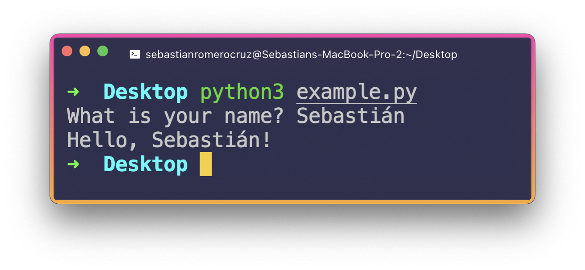

<h2 align=center>Week 02: <em>Day 2</em></h2>

<h1 align=center>Arithmetic Operators and User Input</h1>

<p align=center><strong><em>Song of the day</strong>: <a href="https://youtu.be/4t0xeWFCHho?si=UT042DG2My_mLj86"><strong><u>In The End It Always Does</u></strong></a> by The Japanese House (2023)</em></p>

### Sections

1. [**Lab 02, Question 3 Solution**](#part-1-lab-02-question-3-solution)
2. [**Arithmetic Operators and Type Casting**](#part-2-arithmetic-operators-and-type-casting)
3. [**User Input and Java Classes**](#part-3-user-input-and-java-classes)

### Part 1: _Lab 02, Question 3 Solution_

As you'll see later in the semester, Java encourages you to divide your programs depending on the type of data and/or functionality they represent. So I'll be splitting the main method of my class, `SpeedLimitConverter`, as follows:

```java
class SpeedLimitConverter {
    public static void main(String[] args) {
        // Constants

        // Variables

        // Calculations

        // Display

    }
}
```

<sub>**Code Block 1**: The skeleton of our program.</sub>

Cool, so let's tackle them one-by-one. You could have used either (or both) of the conversion factors that I provided. I chose the second one, so I threw that into our constants section. Recall that constants in Java take the `final` keyword to avoid being modified, and`ARE_WRITTEN_LIKE_THIS`:

```java
// Constants
final double MILES_PER_KILOMETRE = 0.621371;
```

Next up, I put our speed limits in the variables section. You could have technically also thought of these as constants, since nowhere in the program will they ever change. Since we haven't talked about user input just yet, I'd be satisfied if you did either. Recall that these have to have clear names, and follow camelCase:

```java
// Variables
double imperialSpeedLimit = 60.0;
double metricSpeedLimit = 100.0;
```

The calculations that follow are simple using these values. I chose to save their results in variables for ease of printing later:

```java
// Calculations
double imperialToMetricSpeedLimit = imperialSpeedLimit / MILES_PER_KILOMETRE;
double metricToImperialSpeedLimit = metricSpeedLimit * MILES_PER_KILOMETRE;
```

Finally, we can match the sample output in the prompt by doing the following:

```java
// Display
System.out.println(imperialSpeedLimit + " miles per hour is equivalent to " + imperialToMetricSpeedLimit + " kilometres per hour.");
System.out.println(metricSpeedLimit + " kilometres per hour is equivalent to " + metricToImperialSpeedLimit + " metres per hour.");
```

If you chose to do the challenge, I separated it visually from the first part by adding the following comment:

```java
/* CHALLENGE */
```

This is another way of writing comments, and are usually used for denoting more important messages and/or official documentation. Here's the code that got me the correct result (note that, in this case, there were no variables except for the result of the conversion):

```java
/* CHALLENGE */
// Constants
final double ACCELERATION_OF_GRAVITY_SI = 9.81; // m/s^2
final double MILES_IN_METRE = 0.000621371;
final double SECONDS_IN_HOUR = 3600.0;

// Calculations
double imperialAccelerationOfGravity = ACCELERATION_OF_GRAVITY_SI * MILES_IN_METRE * SECONDS_IN_HOUR * SECONDS_IN_HOUR;

// Display
System.out.println(ACCELERATION_OF_GRAVITY_SI + " metres per second-squared is equivalent to " + imperialAccelerationOfGravity + " miles per hour-squared.");
```

You can find my full solution [**here**](code/SpeedLimitConverter.java).

---

### Part 2: _Arithmetic Operators and Type Casting_

The following arithmetic operators are available to us in Java:

| **Symbol** | **Meaning**    | **Example**  | **Result** |
|------------|----------------|--------------|------------|
| **`+`**    | Addition       | `34 + 1`     | `35`       |
| **`-`**    | Subtraction    | `34.0 - 0.1` | `33.9`     |
| **`*`**    | Multiplication | `300 * 30`   | `9000`     |
| **`/`**    | Division       | `1.0 / 2.0`  | `0.5`      |
| **`%`**    | Remainder      | `20 % 3`     | `2`        |

<sub>**Figure 1**: Numeric operators in Java.</sub>

A couple of notes on these:
- Watch out when using the `/` operator—specially if your operands happen to both be `int` types. Java will try its best to preserve the original type of the operands. If they are both integers, it will round _down to the integer closest to the result:

```java
int firstOperand = 3;
int secondOperand = 4;

/**
 * While we would expect something like 0.75 to be printed, this will actually print 0.
 */
System.out.println(firstOperand / secondOperand);
```

In order to avoid this issue, a good tip is to **convert** one or both of your operands to a `double` before or during your division. Conversion between types is called ***casting***, and it would be done as follows:

```java
int firstOperand = 3;
int secondOperand = 4;

double firstOperandDouble = (double) firstOperand;      // 3.0
double secondOperandDouble = (double) secondOperand;    // 4.0
        
System.out.println(firstOperand / secondOperand);       // prints 0.75, a double
```

<sub>**Code Block 2**: Casting integers into `double` types. Note that Java will always pick the most precise type for the result of a mathematical operation. Therefore, if we only casted `firstOperand` as a double and tried `3.0 / 4`, we would get our desired result of `0.75` (since `double` is more precise than `int`).</sub>

**Be careful when typecasting from more precise types (like a `double`) to a less precise type (such as a `float`)**, since you will be losing a good amount of precision and thus could potentially lead to inaccurate results depending on the use case.

- The `%` operator, often called the **modulus** (or mod for short) operator, is often a source of great confusion to students. If you picture a long division, it is basically the number that you get after finishing the process:

```
      1
    ____
13 | 20
     13
 ————————
      7   <---- this is the value that 20 % 13 would give you.
```

---

One last thing you may have noticed (specially if you are coming from a language like Python) is that Java does not have an exponentiation operator. We, thus, have to multiply values several times in order to get exponentiation-like results:

```java
int twoToTheEighthPower = 2 * 2 * 2 * 2 * 2 * 2 * 2 * 2;
```

It's not hard to see how this is not only inefficient, but is also super prone to human error. Favour instead the `Math.pow()` method, which accepts 2 numbers as arguments (the base, and the power) _returns a `double`_:

```java
int twoToTheEighthPower = (int) Math.pow(2, 8);  // 256
```

<sub>**Code Block 3**: Note that we have to cast down to an integer in order for the result to be allowed to be stored
inside our integer parameter.</sub>

### Part 3: _User Input and Java Classes_

Alright, so we've learned how Java represents and deals with basic numerical data so, naturally, our next step is to stop hardcoding that data and begin accepting as external input. Just like with the `input()` function in Python, the most basic way a program can accept external data is through its standard input. In this course's case, that would mean our Terminal:

```python
# Location in my computer: Desktop/example.py
name = input("What is your name? ")
print(f"Hello, {name}!")
```

Terminal output:



<sub>**Figure 2**: Python using MacOS's standard input (my keyboard) and output (my Terminal) to display the execution of a program. The Windows equivalent of `python3` is simply `py`.</sub>

Naturally, Java has something analogous to this, so what is it? In order to properly introduce this, you first need to know that, in Java, there exist two types of values:

1. **Primitives**: Unlike in Python, where every piece of data is an object, these values are considered to be "raw" (they aren't defined by a class definition) data in Java. They are the following:


| **Name**      | **Range of Values**                                                             | **Storage Size** | **Used to represent a...** |
|---------------|---------------------------------------------------------------------------------|------------------|----------------------------|
| **`byte`**    | -2<sup>7</sup> to 2<sup>7</sup> - 1                                             | 8-bits           | Whole number               |
| **`short`**   | -2<sup>15</sup> to 2<sup>15</sup> - 1                                           | 16-bits          | Whole number               |
| **`int`**     | -2<sup>31</sup> to 2<sup>31</sup> - 1                                           | 32-bits          | Whole number               |
| **`long`**    | -2<sup>63</sup> to 2<sup>63</sup> - 1                                           | 64-bits          | Whole number               |
| **`float`**   | Dependent on the computer.                                                      | 32-bits          | Decimal number             |
| **`double`**  | Dependent on the computer, but it is usually twice as precise as `float` values | 64-bits          | Decimal number             |
| **`char`**    | _Technically_ 0 to 2<sup>15</sup> - 1                                           | 16-bits          | Single character, (16-bit unsigned integer representing a Unicode-encoded character) |
| **`boolean`** | -                                                                               | 1-bit            | True or False              |

<sub>**Figure 3**: Primitives in Java.</sub>

2. **Objects**: Data, or a collection of data and functionality, that is organised/defined by a **class definition**. Basically, every single other type in Java aside from the 8 above primitives are objects.

You will have noticed that, from day 01 of this class, every piece of code that have been writing exists within the confines of a class definition:

```java
class HelloWorld {
    public static void main(String[] args) {
        System.out.println("Hello, World!");
    }
}
```

This means that, technically, we can go ahead and create an object of the `HelloWorld` class, just like we did in Python:

```python
class HelloWorld:
    pass

# hello_world_object is an object of the HelloWorld class
hello_world_object = HelloWorld()
```

How do we do this in Java though? The syntax is actually pretty similar to Python's, but you have to add the **`new`** keyword right before the constructor call:

```java
class HelloWorld {
    public static void main(String[] args) {
        // helloWorldObject is an object of the HelloWorld
        HelloWorld helloWorldObject = new HelloWorld();
    }
}
```

Note that we still need to the variable `helloWorldObject`'s type when _instantiating_ it. This might seem a little abstract at the moment, but don't worry too much about it (this is next week's topic, actually). Plus, it'll start making a lot more sense after the first exam.

The only reason why I bring it up is because, **in order to get user input in Java, you need to create an object of the class `Scanner`**:

```java
import java.util.Scanner;

Scanner scanner = new Scanner(System.in);
```

So, what's going on here?

1. We **create a variable** called `scanner` of type `Scanner`. This is a built-in type in Java.
2. We **_instantiate_ a new _object**_ of the `Scanner` class by using the `new` keyword.
3. When we create this `Scanner` object, we **use `System.in` (the operating system's standard input) as an argument** to its constructor.

This object now has the ability to accept input of all sorts (strings, characters, ints, longs, floats, etc.).

```java
// Import the library where the Scanner is defined, util
import java.util.Scanner;

class ScannerExample {
    public static void main(String[] args) {
        // Create a Scanner object and store it inside of the scanner variable
        // Note that, as an argument to its constructor, we need to specify that
        // we are using the system's standard input
        Scanner scanner = new Scanner(System.in);

        // We use the Scanner class's nextLine() method to prompt the user to enter a string,
        // creating a String object
        System.out.print("What is your name? ");
        String name = scanner.nextLine();
        
        // Output
        System.out.println("Your name is " + name + ".");

        // We use the Scanner class's nextInt() method to prompt the user to enter an integer
        System.out.print("How old are you? ");
        int age = scanner.nextInt();
        
        // Output
        System.out.println("You are " + age + "-year(s)-old.");

        // To avoid memory leaks, we need to close the scanner so that it stops expecting input
        // using its close() method
        scanner.close();
    }
}
```

Here are a few of the different methods that the `Scanner` class has defined to accept input:

|Method|Description|
|-|-|
|**`nextInt()`**|reads an `int` value from the user|
|**`nextFloat()`**|reads a `float` value from the user|
|**`nextBoolean()`**|reads a `boolean` value from the user|
|**`nextLine()`**|reads a line of text from the user|
|**`next()`**|reads a word from the user|
|**`nextByte()`**|reads a `byte` value from the user|
|**`nextDouble()`**|reads a `double` value from the user|
|**`nextShort()`**|reads a `short` value from the user|
|**`nextLong()`**|reads a `long` value from the user|

<sub>**Figure 4**: Some of the methods of the [**`Scanner`**](https://docs.oracle.com/javase/8/docs/api/java/util/Scanner.html) class.</sub>

A lot of students tend to ask if using the `close()` method is strictly necessary. While your program will likely run fine and without any errors, the `Scanner` object will stay open throughout the operation of your application if you don't close it, causing your app to use up more and more memory, slowing down your machine. **For this reason, I'm going to enforce the use of `close()` with `Scanner` this semester**.

- **On homework assignments**: Not closing a `Scanner` object will result in a 0.5 deduction per `Scanner` object. 
- **On exams**: Not closing a `Scanner` object will result in a 1.5 deduction per `Scanner` object. 

<sub>**Previous: [Variables and Constants](/src/03-variables-constants)** || **Next: [Selection Statements]()**</sub>