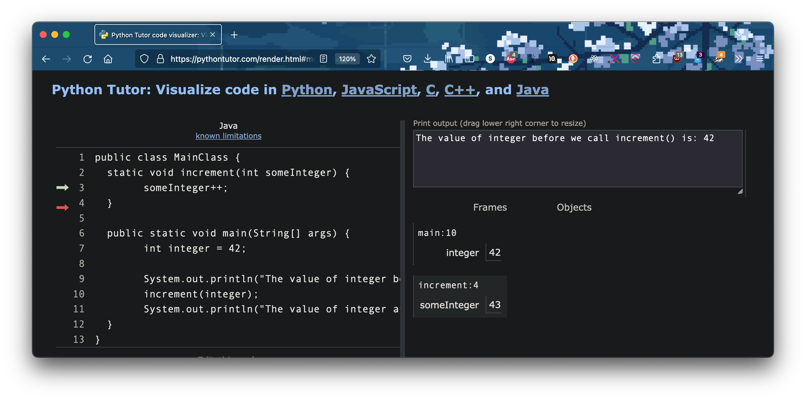
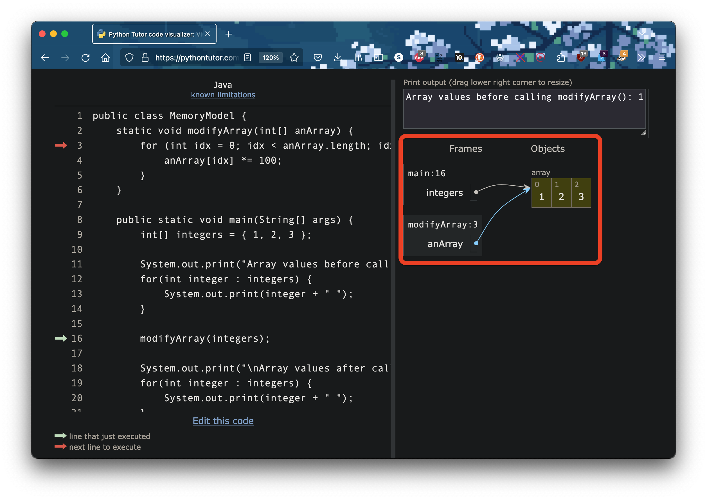
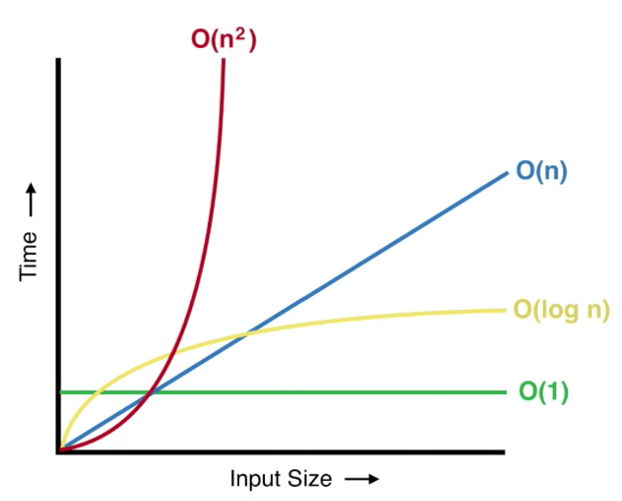

<h2 align=center>Week 05: <em>Day 2</em></h2>

<h1 align=center>Arrays: <em>Memory, 2D Arrays, and Binary Search</em></h1>

<p align=center><strong><em>Song of the day</strong>: <a href="https://youtu.be/LggGUY7wCFg?si=xoywvbFC_nzepEJG"><strong><u>佐賀事変 (The Saga Incident)</u></strong></a> by FranChouChou (2021)</em></p>

### Sections

1. [**Passing By Value vs. Passing By Reference**](#part-1-passing-by-value-vs-passing-by-reference)
2. [**2D Arrays In Java**](#part-2-2d-arrays-in-java)
3. [**Binary Search**](#part-3-binary-search)

### Part 1: _Passing By Value vs. Passing By Reference_

One thing I want to make sure that we understand moving forward is what exactly happens when we pass in an array as an argument to a method. To start, what will happen if we compile and run the following code?

```java
class MemoryModel {
    static void increment(int someInteger) {
        someInteger++;
    }

    public static void main(String[] args) {
        int integer = 42;

        System.out.println("The value of integer before we call increment() is: " + integer);
        increment(integer);
        System.out.println("The value of integer after we call increment() is: " + integer);
    }
}
```

```
➜  javac MemoryModel.java 
➜  java MemoryModel      
The value of integer before we call increment() is: 42
The value of integer after we call increment() is: 42
```

If you expected to see `43` in the second line, it is probably because you thought that the same value saved in the memory slot we called `integer` is also being referenced by the parameter `someInteger`. It's a good guess, but the thing to know here is that, when it comes to passing _primitives_ into methods, _Java creates a copy of those primitives for the parameters._ We can see this in this [**code visualiser**](https://pythontutor.com/visualize.html#mode=edit), showing us the memory model of the above code:



<sub>**Figure 1**: Notice that there are two separate integers holding integers, and only `someInteger` got incremented.</sub>

This is known as **passing by value** and, like I said, only applies to primitives in Java.

---

In Java, when you pass an array as a parameter to a method, however, you are passing a _reference to the **exact memoery address where the array starts**, not a copy of the array itself. This means that the method will have access to the actual array in memory and any changes made to the array within the method will affect the original array.

Because only the reference is passed, the size of the array does not need to be copied and the memory use is minimal. However, it is important to note that if the method modifies the elements of the array, these changes will be reflected in the original array as well.

Here is an example to illustrate this:

```java
class MemoryModel {
    public static void modifyArray(int[] anArray) {
        for (int idx = 0; idx < anArray.length; idx++) {
            anArray[idx] *= 100;
        }
    }

    public static void main(String[] args) {
        int[] integers = { 1, 2, 3 };

        System.out.print("Array values before calling modifyArray(): ");
        for(int integer : integers) {
            System.out.print(integer + " ");
        }
        
        modifyArray(integers);
        
        System.out.print("\nArray values after calling modifyArray(): ");
        for(int integer : integers) {
            System.out.print(integer + " ");
        }
    }
}
```

Output:

```
➜  javac MemoryModel.java
➜  java MemoryModel      
Array values before calling modifyArray(): 1 2 3 
Array values after calling modifyArray(): 100 200 300
```

In this example, the `modifyArray` method is passed a _reference_ to the original array `integers`. The method modifies the elements of the array, and when the array is printed in the `main` method, the changes made in `modifyArray` are reflected in the output. This demonstrates that passing arrays as parameters in Java allows for efficient memory management by only passing a reference to the array. This is know as **passing by reference**.

We can also see this represented in our code visualiser by the arrows coming from both `integers` and `anArray` pointing to the same place in memory where the array values are stored:



<sub>**Figure 2**: Notice that no point is a copy of the array created in memory.</sub>

<br>

### Part 2: _2D Arrays In Java_

I quickly want to introduce how to make arrays of arrays in Java (you may remember lists of lists in Python) and how to create and work with them.

In a 2D array, each element is itself an array, which can hold a list of values.

To declare a 2D array in Java, you use the following syntax:

```java
type[][] arrayName = new type[rowSize][colSize];
```

For example, to create a 2D array of integers with 3 rows and 4 columns, you would write:

```java
int[][] numbers = new int[3][4];
```

To access and manipulate elements in a 2D array, you use nested loops. For example, to populate a 2D array with values, you could use nested for loops like this:

```java
or (int row = 0; row < numbers.length; row++) {
    for (int col = 0; col < numbers[row].length; col++) {
        numbers[row][col] = row * col;
    }
}
```

This generates a 2D array holding a multiplication table. To index values from a 2D array, you would also use nested loops:

```java
for (int row = 0; row < numbers.length; row++) {
    for (int col = 0; col < numbers[row].length; col++) {
        System.out.print(numbers[row][col] + " ");
    }
    System.out.println();
}
```

Output:

```
➜  javac NestedArrays.java
➜  java NestedArrays      
0 0 0 0 
0 1 2 3 
0 2 4 6 
```

Of course, if you so wish, you can also initialise 2D arrays with starting values, as follows:

```java
int[][] integers = {
    {1, 2, 3},
    {4, 5, 6},
    {7, 8, 9}
};
```

<br>

### Part 3: _Binary Search_

There are always these great, pivotal moments in every programmer's career—learning how to iterate, learning a second language, etc.. One of those moments has to be, without a doubt, the moment you learn about **binary search**. Binary search is a lovely algorithm; it's simple, it's elegant, it's easy to understand, implement, and use. And, so, it is going to be our main focus for today.

Say, for instance, that we started with an array of _sorted_ integers (that is, they are in increasing order):

```java
int[] integers = {
    13, 29, 33,
    42, 51, 67,
    74, 82, 99
};
```

And I asked you to write a method that returns the index of a number if that number exists in `integers`, and `-1` if it doesn't. You might try to linearly search through every single value of the array to check if any of them match your target number, like this:

```java
class BinarySearch {

    static int linearSearch(int[] array, int target) {
        // Check every single index from 0 to the length of the array
        for (int idx = 0; idx < array.length; idx++) {
            // And if the value at any of those indeces matches the target
            if (array[idx] == target) {
                // Return that index
                return idx;
            }
        }

        // If none of those values matched the target, return -1
        return -1;
    }

    public static void main(String[] args) {
        int[] integers = {
            13, 29, 33,
            42, 51, 67,
            74, 82, 99
        };

        int target = 42;
        int indexOf42 = linearSearch(integers, target);

        System.out.println("The index of " + target + " is " + indexOf42);
    }
}
```

Output:

```
➜  javac BinarySearch.java
➜  java BinarySearch 
The index of 42 is 3
```

If we ran this program a billion times using completely random numbers, the amount of times that the `for`-loop inside of `linearSearch` runs ends up being _the length of the array that it is iterating through_. What this means is that, no matter how small or how large the array is, and no matter which sorted set of numbers are included in that array, **it will always take an average of `n`-passes through the array in order to find the target, if at all**, where `n` represents the length of the array. We call the speed of this algorithm **`O(_n_)`** time, because it goes proportionally with the size of the array.

Now, you might think that's not too bad. After all, how else are we going to do it? We can't simply skip an entire section of the array in order to cut the search time by some factor. This is as fast as we can go, right?

...right?

Lmao obviously not. That's why you're taking this class. It turns out that, if the elements of the array in question are sorted, we _can_ cut the average amount of time needed to find the desired element, and not by an insignificant amount of time, either. That's where binary search comes in. Let's review the steps to the algorithm:

1. Define a method that takes in the sorted array and the target element as parameters.

1. Create two integers, `start` and `end`, to represent the _range of elements we are searching within_. Initially, `start` begins at the first element of the array, and `end` starts at the last element of the array, since we haven't started our search yet.

2. Now, calculate the middle index (`mid`) of the current range by finding the average of `start` and `end`.

3. Check if the element at the index `mid` is equal to the target element. If so, return the index of the target element, and the method is over.

4. If the element at the index `mid` is greater than the `target`, update `end` to be one less than the `mid` to search in the left half of the array. We know that every number above `mid` is larger than it (since the array is sorted) so there is no way for our target to be in that half.

5. If the element at the index `mid` is less than the `target`, update `start` to be one more than the `mid` to search in the right half of the array. We know that every number below `mid` is smaller than it (since the array is sorted) so there is no way for our target to be in that half.

6. Repeat steps 3-6 while `start` is less than or equal to `end`.

7. If the target element is not found, return `-1` to indicate that the element is not present in the array.

In Java this would be:

```java
static int binarySearch(int[] array, int target) {
    int start = 0;
    int end = array.length - 1;
    
    while (start <= end) {
        int mid = (start + end) / 2;
        
        if (array[mid] == target) {
            return mid;
        }
        
        if (array[mid] < target) {
            start = mid + 1;
        } else {
            end = mid - 1;
        }
    }
    
    return -1;
} 
```

So how much time does this cut from our search? Well, take a look at the following gif:


<sub>**Figure 3**: That's quite a lot, isn't it?</sub>

Is it half the time? No, smaller. It's actually **log<sub>2</sub>(n)**. Here's a table for visual reference, showing the difference in runtime of various algorithms depending on the size of the dataset:



<sub>**Figure 4**: How quickly (or slowly) runtimes grow as the size of the array also grows ([**source**](https://learn2torials.com/a/logarithmic-time-complexity)).</sub>

You can see here that that **O**( _log<sub>2</sub>(n)_ ) become virtually constant as the size of the array grows, making essentially no difference whether the array is of size 100 or of size 1000. Size **O**( _n_ ), however, will continue growing and growing with the size of the array, taking much much longer for an array of size 1000 than for one of size 100.