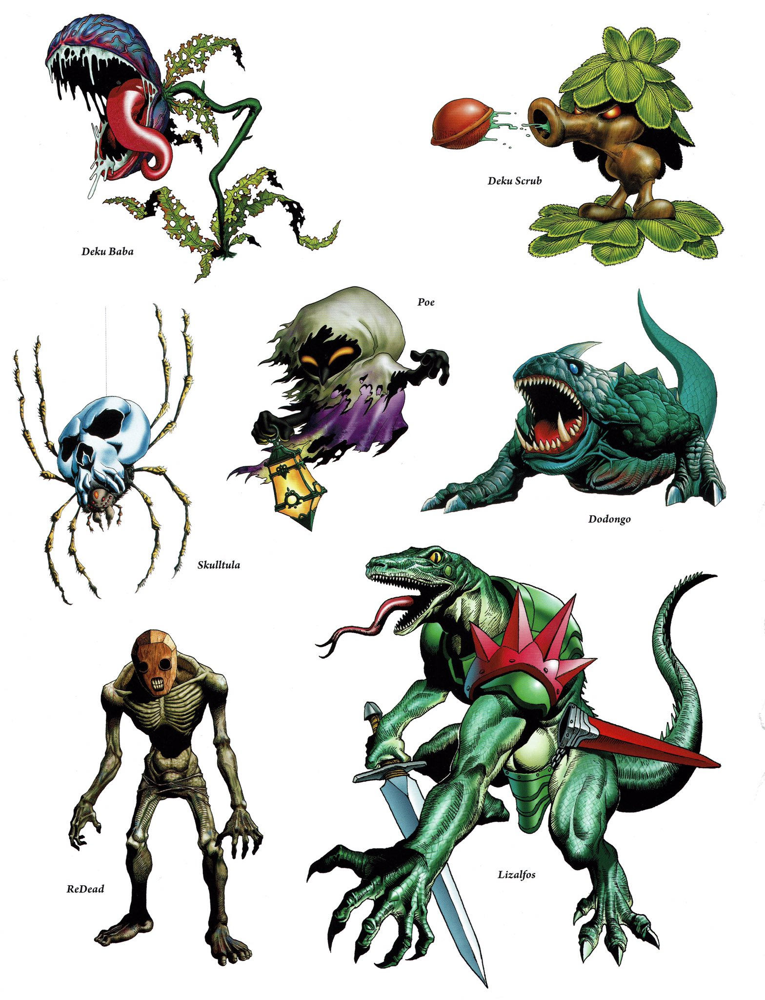
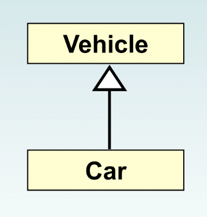

<h2 align=center>Week 08</h2>

<h1 align=center>Inheritance</h1>

<p align=center><strong><em>Song of the day</strong>: <a href="https://youtu.be/krxU5Y9lCS8?si=6OIopQ6cc6wTyeeN"><strong><u>You Can't Always Get What You Want</u></strong></a> by The Rolling Stones (1969)</em></p>

---

### Sections

1. [**`printf`**](#part-1-printf)
2. [**Inheritance**](#part-2-inheritance)
3. [**Creating A Superclass**](#part-3-creating-a-superclass)
4. [**Creating a Subclass**](#part-4-creating-a-subclass)

---

### Part 1: _`printf`_

**`System.out.printf`** is a method in Java that allows you to format and print output to the console. It is similar to `System.out.println`, but provides more control over the formatting of the output.

Here's the basic syntax of `System.out.printf`:

```java
System.out.printf(format, arg1, arg2, ...);
```

The `format` parameter is a string that specifies the format of the output, and the `arg1`, `arg2`, etc. parameters are the values to be formatted and printed.

Here's an example of how to use `System.out.printf` to print a formatted string with two variables:

```java
String name = "Euphyllia";
int age = 30;
System.out.printf("Hello, %s! You are %d years old.\n", name, age);
```

This will output:

```
Hello, Euphyllia! You are 30 years old.
```

Here are some of the most common formatting specifiers that you can use with `System.out.printf`:

| Specifier | Description            |
|-----------|------------------------|
| `%d`        | integer              |
| `%f`        | floating point       |
| `%s`        | string               |
| `%c`        | character            |
| `%b`        | boolean              |
| `%n`        | newline              |
| `%t`        | date/time conversion |
| `%e`        | scientific notation  |
| `%x`        | hexadecimal          |
| `%o`        | octal                |

<sub>**Figure 1**: Format specifiers that can be used with `printf`.</sub>

You can use these specifiers in the `format` string to control how the variables are formatted and printed. For example, to format an integer with leading zeros, you can use `%04d`:

```java
int number = 42;
System.out.printf("Number: %04d\n", number);
```

This will output:

```
Number: 0042
```

Another example:

```java
double pi_approximation = Math.PI;
System.out.printf("Pi approximated to 3 significant figures is: %.3f%n", pi_approximation);
```

This will output:

```
Pi approximated to 3 significant figures is: 3.142
```

<br>

### Part 2: _Inheritance_

Today we're going to be talking about the concept of **inheritance**. Fundamentally, inheritance is used to organize the classes that we create. More importantly, though, inheritance enhances our ability to _reuse classes_ in powerful ways.

Programmers are lazy by nature, so this sounds right up our alley. Let's illustrate this concept via an example that will totally not get me sued by Nintendo.

Let's say you are a video game developer, and you are planning your suite of enemies:



<sub>**Figure 2**: The totally original suite of enemies that you've designed for your video game. [**Source**](https://twitter.com/VGArtAndTidbits/status/921422498872348672?s=20)</sub>

As you can see, all of these enemies are radically different in design and, thus, most likely also in behaviour. We could absolutely create classes for every single one of them:

```java
// DekuBaba.java
public class DekuBaba {
    /**
     * DekuBaba class definition here...
     * **/
}
```

```java
// DekuScrub.java
public class DekuScrub {
    /**
     * DekuScrub class definition here...
     * **/
}
```

```java
// Poe.java
public class Poe {
    /**
     * Poe class definition here...
     * **/
}
```

This is totally allowed, and is what we would have done with our pre-CS122 knowledge. So, why is this inefficient? Well, despite being different in many ways, enemies in the same video game are probably share a lot of similarities. For example, all enemies in this game probably have:

- Name
- Health points (HP)
- Weapons and/or attacks
- Attack power
- Potential dropped items
- Number of times you have to defeat them for them to stay down (thanks, Sekiro)

That would mean that we would literally have to write several identical attributes and methods for each of these enemy classes. Not only that, but were we ever to want to make a change that applied to all kinds of enemies, we would have to make sure to make that change in *all* of our enemy classes. This is, of course, not a good use of our time and very prone to human error. This is where inheritance comes in.

> Inheritance allows a software developer to **derive a new class _(child class/subclass)_ from an existing class (parent class/superclass)**. As the name implies, the child inherits all characteristics from the parent class.
> 
> Proper inheritance creates an ***is-a*** relationship. That is, the child ***is a*** more specific version of the parent.



<sub>**Figure 3**: Inheritance relationships are shown in a UML diagram using a solid arrow with an unfilled triangular arrowhead pointing to the parent class.</sub>

<br>

### Part 3: _Creating A Superclass_

So what would this look like in code? We would have to define some sort of base `Enemy` class that will hold all of the attributes and methods that all enemy objects **will have in common**:

```java
// Enemy.java
public class Enemy {
    private String name;
    private int healthPoints;
    private String weaponName;
    private int attackPower;

    protected Enemy(String name, int healthPoints, String weaponName, int attackPower) {
        this.name = name;
        this.healthPoints = healthPoints;
        this.weaponName = weaponName;
        this.attackPower = attackPower;
    }

    public float attack() {
        return (float) attackPower / healthPoints;
    }
    
    // Several getters below...
}
```

<sub>**Code block 1**: The definition of our `Enemy` superclass. Full implementation [**here**](code/Enemy.java).</sub>

There's a new keyword here, **`protected`**. What does this mean?

The `protected` modifier allows all child classes to reference a variable or method in the parent class. You might be wondering why `public` wouldn't be enough. The problem here is we **don't** want users to instantiate `Enemy` objects. It would be the equivalent of saying that you're eating just "food" for dinner. Obviously you're eating some type of food for dinner. You want to express the actual properties of the concrete food that you are eating.

In our case, to say you are fighting an "enemy" is too abstract—we want to know what _kind_ of enemy we are talking about. The alternative to `public` is `private`, but the problem there is that if we mark the `Enemy` class's constructor as `private`, its subclasses ***cannot*** access it. That defeats the whole purpose of inheritance. Thus, the `protected` modifier gives us that nice in-between: a `protected` attribute/method is accessible by both children of the class, and visible to any class in the same package as the parent class.

<br>

### Part 4: _Creating A Subclass_

So, let's define a child class, using `DekuScrub` as an example. One of the characteristics of Deku Scrubs is that they can *hide* from the enemy, and cannot be damaged in that state. So let's add this functionality as an attribute that only the `DekuScrub` `Enemy` will have:

```java
// DekuScrub.java
public class DekuScrub extends Enemy {
    private boolean isHidden;

    public DekuScrub(boolean isHidden) {
        super("Deku Scrub", 100, "Deku Seeds", 20);
        this.isHidden = isHidden;
    }

    public void hide() {
        isHidden = !isHidden;
    }

    public boolean getIsHidden() {
        return isHidden;
    }
}
```

<sub>_**Code block 2**: The definition of our `Enemy` superclass. Full implementation [**here**](code/DekuScrub.java)._</sub>


What is new here? Most conspicuously, the `extends` and `super` keywords. **`extends`** simply tells Java that the `DekuScrub` class is a subclass of the `Enemy` class. This is all it takes to define subclasses from a superclass.

As you can see above, we passed in as arguments the necessary attributes needed to instantiate the `Enemy` class. You can probably guess that the `super` reference **invokes the parent's constructor**. After you use it, you can move on to the more subclass-specific attributes. 

The `super` reference, if used at all, must **always be the first line of your constructor**.

You can also use the `super` reference to reference other attributes and methods defined in the parent's class.

Check out the following [**sample behaviour**](code/Game.java) of the `DekuScrub` class:

```java
public class Game {
    //**
    // A simple demonstration of what our enemies can do
    // */
    public static void main(String[] args) {
        // Creating a DekuScrub object only using one argument, isHidden
        DekuScrub dekuScrub = new DekuScrub(true);

        // dekuScrub, however, can use all public and protected data and methods defined in the Enemy class
        System.out.printf(
                "This %s%s is attacking with %.2f power!\n",
                dekuScrub.getIsHidden() ? "hidden " : "",
                dekuScrub.getName(),
                dekuScrub.attack()
        );

        dekuScrub.hide();
        dekuScrub.hide();
    }
}
```

By the way, some languages support multiple inheritance. That is, the practice of creating a subclass from two or more superclasses. This practice is generally not needed and it leads to all sorts of problems, so Java does ***not*** support it.