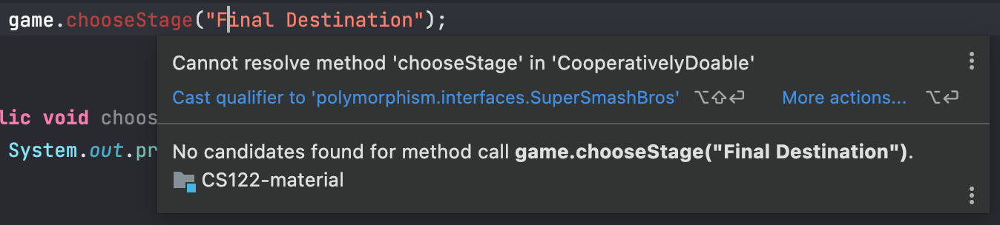
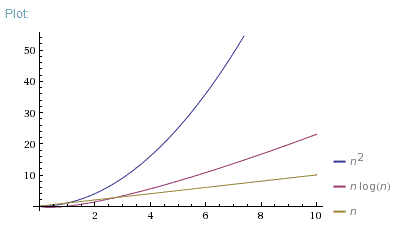

<h2 align=center>Week 11: <em>Day 2</em></h2>

<h1 align=center>Polymorphism: <em>Interfaces</em></h1>

<p align=center><strong><em>Song of the day</strong>: <a href="https://youtu.be/8ZP5eqm4JqM?si=GinLsPy4AJyfPxg1"><strong><u>Bibbidiba</u></strong></a> by Hoshimachi Suisei (2024)</em></p>

---

### Sections

1. [**Polymorphism Via Inheritance**](#part-1-polymorphism-via-inheritance)
2. [**Sorting With Interfaces**](#part-2-sorting-with-interfaces)
3. [**Sorting Our Custom Classes Using `Comparable`**](#part-3-sorting-our-custom-classes-using-comparable)
4. [**Selection Sort**](#part-4-selection-sort)
5. [**Insertion Sort**](#part-5-insertion-sort)
5. [**Binary search**](#part-6-binary-search)

---

### Part 1: _Polymorphism via inheritance_

We spoke about the effects and value of polymorphism through the lens of inheritance, but polymorphic references can be set up via interfaces as well. Since interfaces can be pretty removed from the concrete classes that implement it, this can allow for some pretty cool behaviour. Suppose we have an interface called `CooperativelyDoable` that represents things in real life that can be physically done with other people:

```java
public interface CooperativelyDoable {
    public void addParticipant(String participantName);
    public void begin();
}
```

<sub>**Code Block 1**: A pretty general [**interface**](code/CooperativelyDoable.java).</sub>

Now, check out the following [**two**](code/SuperSmashBros.java) [**sublasses**](code/UnitedNationsGeneralAssembly.java):

```java
// SuperSmashBros.java
public class SuperSmashBros implements CooperativelyDoable {

    public void chooseStage(String stageName) {
        System.out.printf("Stage %s chosen!", stageName);
    }

    @Override
    public void addParticipant(String participantName) {
        System.out.printf("Adding character %s to the roster.", participantName);
    }

    @Override
    public void begin() {
        System.out.println("FIGHT!");
    }
}
```
```java
// UnitedNationsGeneralAssembly.java
public class UnitedNationsGeneralAssembly implements CooperativelyDoable {

    public void createCommittee(String committeeName) {
        System.out.printf("Creating the %s...", committeeName);
    }

    @Override
    public void addParticipant(String participantName) {
        System.out.println("Ratifying %s's application to the UN...");
    }

    @Override
    public void begin() {
        System.out.println("DIPLOMACY!");
    }
}
```

<sub>**Code Blocks 2 & 3**: Two radically different subclasses.</sub>

Can we form polymorphic references using `CooperativelyDoable`? It turns out, incredibly, that we can:

```java
CooperativelyDoable meeting = new UnitedNationsGeneralAssembly();
CooperativelyDoable game = new SuperSmashBros();
```

Unsurprisingle, we're pretty limited in functionality when we do this:



<sub>**Figure 1**: Remember—late binding.</sub>

Though, of course, you can avoid doing this by casting:

```java
((SuperSmashBros) game).chooseStage("Final Destination");
```

<sub>**Code Blocks 4**: Casting a `CooperativelyDoable` reference to a `SuperSmashBros` one. This is totally valid.</sub>

<br>

### Part 2: _Sorting With Interfaces_

There's a pretty neat algorithm called selection sort, whereby you sort elements in a list/array using the following algorithm:

1. Find the smallest value in the list
2. Switch it with the value in the first position
3. Find the next smallest value in the list
4. Switch it with the value in the second position
5. Repeat until all values are in their proper places


<sub>**Figure 2**: A nice animation of selection sort.</sub>

This algorithm is known for being pretty simple to grasp, but also very inefficient (it is **O(n<sup>2</sup>)**). Still, for our purposes, it is perfect. Let's say we have our coordinate class from earlier in the semester:

```java
public class Coordinates {
    private final double latitude;
    private final double longitude;

    public static void main(String[] args) {
        Coordinates pointA = new Coordinates(34.5d, 40.0d);
        Coordinates pointB = new Coordinates(34.5d, 40.0d);

        System.out.println(pointA.equals(pointB));
    }

    public Coordinates(double latitude, double longitude) {
        this.latitude = latitude;
        this.longitude = longitude;
    }

    public double getLongitude() {
        return longitude;
    }

    public double getLatitude() {
        return latitude;
    }

    @Override
    public boolean equals(Object o) {
        // Check if the Object instance o exists and is of the same class.
        if (o == null || getClass() != o.getClass()) {
            return false;
        }

        return ((Coordinates) o).getLatitude() == getLatitude() && ((Coordinates) o).getLongitude() == getLongitude();
    }
}
```

How do we sort coordinate objects? Integers are easy—there is only one value to sort. But we can't very well ask Java to arbitrarily pick which of our two values it should sort by. It would be pretty convenient if there was an interface, like `CooperativelyDoable`, that was instead something like—I don't know—`Comparable`. Oh wait, there is one:

```java
// Notice the way we put the classname inside the <> operator of the Comparable interface
public class Coordinates implements Comparable<Coordinates> {
    private final double latitude;
    private final double longitude;

    public Coordinates(double latitude, double longitude) {
        this.latitude = latitude;
        this.longitude = longitude;
    }

    @Override
    public int compareTo(Coordinates o) {
        // Here, we are asking Java to compare the string versions of our objects. If this is larger, this will return
        // 1. If it is smaller, it will return 0. Arrays.sort() uses these values with algorithms like selection sort
        // in order to actually sort.
        return toString().compareTo(o.toString());
    }

    @Override
    public String toString() {
        return "(%.2f, %.2f)".formatted(latitude, longitude);
    }
}
```

If we then created an array of random coordinates, and sorted them with `Arrays.sort()`:

```java
Coordinates[] coordinates = {
        new Coordinates(Math.random(), Math.random()),
        new Coordinates(Math.random(), Math.random()),
        new Coordinates(Math.random(), Math.random()),
        new Coordinates(Math.random(), Math.random()),
        new Coordinates(Math.random(), Math.random()),
        new Coordinates(Math.random(), Math.random()),
};

// Before sorting
for (Coordinates cooordinate: coordinates) {
    System.out.println(cooordinate);
}

System.out.println();

Arrays.sort(coordinates);

// After sorting
for (Coordinates cooordinate: coordinates) {
    System.out.println(cooordinate);
}
```

Output:

```text
(0.67, 0.09)
(0.65, 0.47)
(0.31, 0.87)
(0.26, 0.71)
(0.64, 0.71)
(0.32, 0.93)

(0.26, 0.71)
(0.31, 0.87)
(0.32, 0.93)
(0.64, 0.71)
(0.65, 0.47)
(0.67, 0.09)
```

<br>

### Part 3: _Sorting Our Custom Classes Using `Comparable`_

We learned last class that we can adapt our classes to be sortable (i.e. put in some kind of order) by having your class implement the `Comparable` interface. Let's check out a simple class representing a country:

```java
public class Country implements Comparable<Country> {

    private final String stateName;
    private final int startYear;
    private final String continent;

    public Country(String stateName, int startYear, String continent) {
        this.stateName = stateName;
        this.startYear = startYear;
        this.continent = continent;
    }

    // INHERITED FROM THE Object CLASS...
    @Override
    public boolean equals(Object o) {
        if (o == null || !this.getClass().equals(o.getClass())) {
            return false;
        }

        return continent.equals(((Country)o).continent) &&
                startYear == ((Country)o).startYear &&
                stateName.equals(((Country)o).stateName);
    }

    @Override
    public String toString() {
        return "%s, %s: %d".formatted(stateName, continent, startYear);
    }

    // ACCESSIBLE VIA THE Comparable INTERFACE...
    @Override
    public int compareTo(Country o) {
        return Integer.compare(startYear, o.startYear);
    }
}
```

<sub>**Code Block 1**: Our [**`Country` class**](code/Country.java). Notice that we have to specify that `Country` objects will be comparable with only other `Country` objects via extending `Comparable<Country>`.</sub>

Here, I overrode the `Object` class's `equals()` method to return `true` if and only if both objects' `stateName`, `startYear`, and `continent` attributes are also equal. This completes half of our problem; if we know how `Country` objects act when they are equal to each other, how should they act in relation to each other if they are _not_ equal?

This is where the `Comparable` interface comes in. I can basically do whatever I want here, but to simplify things, I told Java to only consider the countries' founding year (`startYear`) when comparing two `Country` objects.

Using the `Arrays` class's `sort()` method, we can see it at work:

```java
// Create a few Country objects and put them in an array...
Country france = new Country("France",1958, "Europe");
Country japan = new Country("Japan", 1947, "Asia");
Country portugal = new Country("Portugal", 1976, "Europe");
Country algeria = new Country("Algeria", 1962, "Africa");
Country mexico = new Country("Mexico", 1917, "North America");

Country[] countries = new Country[] {
        portugal, japan, mexico, france, algeria
};

// Print contents before sorting...
for (Country country : countries) {
    System.out.println("-> " + country);
}

// Sort...
Arrays.sort(countries);
System.out.println();  // for nice formatting

// Print contents after sorting...
for (Country country : countries) {
    System.out.println("-> " + country);
}
```

Output:

```text
-> Portugal, Europe: 1976
-> Japan, Asia: 1947
-> Mexico, North America: 1917
-> France, Europe: 1958
-> Algeria, Africa: 1962

-> Mexico, North America: 1917
-> Japan, Asia: 1947
-> France, Europe: 1958
-> Algeria, Africa: 1962
-> Portugal, Europe: 1976
```

Awesome. But how does this sorting actually work under the hood? Java's `Arrays.sort()` method uses a rather fast algorithm to do this, but we'll start with slightly simpler, less effective ones to get a feel for how polymorphism  plays the lead role here.

<br>

### Part 4: _Selection Sort_

I'm going to make our sorters public abstract methods of a single class, so that we can keep them in one place, and so we can access the methods without creating `Comparer` objects. Let's call this class `Comparer`:

```java
public class Comparer {
    public static void selectionSort(Comparable[] list) {
        // Sorting...
    }
}
```

Recall the steps for selections sort:

1. Find the smallest value in the list
2. Switch it with the value in the first position
3. Find the next smallest value in the list
4. Switch it with the value in the second position
5. Repeat until all values are in their proper places


<sub>**Figure 1**: A nice animation of selection sort.</sub>

The way we program this is as follows:

```java
public class Comparer {
    public static void selectionSort(Comparable[] list) {
        int indexOfMinimum;
        Comparable temp;
        
        // 5. Repeat until all values are in their proper places
        for (int index = 0; index < list.length - 1; index++) {
            // 1. Find the smallest value in the list
            indexOfMinimum = index;
            for (int scannerIndex = index + 1; scannerIndex < list.length; scannerIndex++) {
                if (list[scannerIndex].compareTo(list[indexOfMinimum]) < 0) {
                    indexOfMinimum = scannerIndex;
                }
            }

            // 3. Find the next smallest value in the list
            temp = list[indexOfMinimum];
            
            // 4. Switch it with the value in the second position
            list[indexOfMinimum] = list[index];
            list[index] = temp;

            System.out.println();
        }
    }
}
```

<sub>**Code Block 2**: An implementation of `selectionSort()`.</sub>

The keys here are lines like `Comparable[] list` and `Comparable temp;`. Java does not know, and does not care, what kind of `Comparable` class we are dealing with here—**it knows that, because we implemented the `Comparable` class, we will be able to work with them in `selectionSort()`. Let's see it in action with our `Country` objects:

```java
// Create a few Country objects and put them in an array...
Country france = new Country("France", 1958, "Europe");
Country japan = new Country("Japan", 1947, "Asia");
Country portugal = new Country("Portugal", 1976, "Europe");
Country algeria = new Country("Algeria", 1962, "Africa");
Country mexico = new Country("Mexico", 1917, "North America");

Country[] countries = new Country[] {
        portugal, japan, mexico, france, algeria
};

// Print contents before sorting...
for (Country country : countries) {
    System.out.println("-> " + country);
}

// Sort...
Comparer.selectionSort(countries);
System.out.println();  // for nice formatting

// Print contents after sorting...
for (Country country : countries) {
    System.out.println("-> " + country);
}
```

Output:

```text
-> Portugal, Europe: 1976
-> Japan, Asia: 1947
-> Mexico, North America: 1917
-> France, Europe: 1958
-> Algeria, Africa: 1962

-> Mexico, North America: 1917
-> Japan, Asia: 1947
-> France, Europe: 1958
-> Algeria, Africa: 1962
-> Portugal, Europe: 1976
```

And we got it. This algorithm would work with quite literally **any class that implemented the `Comparable` interface (so long as you define the `equals()` method, of course. But you should be doing that for _all_ of your classes.)

<br>

### Part 5: _Insertion Sort_

You may or may not be aware of this, but sorting algorithms are by far some of the most discussed topics in computer science. There are quite literally hundreds of them, and visualising them is [**very fun**](https://youtu.be/LOZTuMds3LM). Let's take a look at another simple one—insertion sort. The basic steps here are:

1. Consider the first item to be already sorted.
2. Insert the second item into the sorted sublist, shifting the first item to the left to make room to insert the new one.
3. Insert the third item into the sorted sublist (of two items), shifting items as necessary.
4. Repeat until all values are inserted into their proper positions.


<sub>**Figure 2**: A nice animation of insertion sort. Notice that the algorithm always keeps track of the current smallest value of each pass.</sub>

We would program this in the following way:

```java
public class Comparer {
    public static void insertionSort(Comparable[] list) {
        for (int index = 1; index < list.length; index++) {
            Comparable value = list[index];
            int position = index;

            // Shift smaller values to the left while the value is smaller than the previous element
            while (position > 0 && value.compareTo(list[position - 1]) < 0) {
                list[position] = list[position - 1];
                list[position - 1] = value;
                position--;
            }

            System.out.println();
        }
    }
}
```

<sub>**Code Block 3**: An implementation of `insertionSort()`.</sub>

Again, this method has absolutely no concept of which kind of `Comparable` we're dealing with here—thanks to polymorphism, it doesn't need to know to do its job.

---

Both of these sorting algorithms are simple, but they are nowhere close to being the most efficient that we have developed. They both have outer loops that scan all elements, and inner loops that compare a value with almost all values in the list. So, in effect, for every single element in our list, we have to traverse the **entire** list to check for a smaller value. In other words, approximately _n_<sup>2</sup>-number of comparisons are made in order to sort a list of size-_n_. We therefore say, in computer science, that these sorting algorithms are of order _n_<sup>2</sup>.

More efficient algorithms are, for example, of order _n_ log<sub>2</sub>_n_, which grows considerably slower the larger an array is when compared to _n_<sup>2</sup>:



<sub>**Figure 3**: Time complexity of _n_, _n_ log<sub>2</sub>_n_, and _n_<sup>2</sup> algorithms.</sub>

But that, thankfully, is a story for another day.

<br>

### Part 6: _Binary Search_

We already talked about the **binary search** algorithm. As a reminder, the steps go like this:

1. Examine the middle element of the list.
2. If it is the number you are looking for, then you're done.
3. If it isn't, you can limit the remaining search to either the left or the right half of the array, depending on 
whether the target number is smaller or larger than the target. For example, if the middle element of the array was 5,
and your target number was 7, then you can limit your search to the upper half of the array, since 7 cannot exist before
5 in a sorted list.
4. Repeat steps from 1-3 until you find your target. If you don't, then your target doesn't exist in the list, and 
you're done.


<sub>**Figure 5**: A nice animation comparing the speed of binary search and linear search.</sub>


<sub>**Figure 6**: Linearly searching for the number 33 in a _sorted_ list of numbers.</sub>

The implementation, using `Comparable` polymorphism, is as follows:

```java
public class Comparer {
    public static Comparable binarySearch (Comparable[] list, Comparable target) {
        int lowIndex = 0, highIndex = list.length - 1, midIndex = 0;
        boolean isFound = false;

        // 4. Repeat steps from 1-3 until you find your target.
        while (!isFound && lowIndex <= highIndex) {
            // 1. Examine the middle element of the list.
            midIndex = (lowIndex + highIndex) / 2;

            if (list[midIndex].equals(target)) {
                // 2. If it is the number you are looking for, then you're done.
                isFound = true;
            } else {
                if (target.compareTo(list[midIndex]) < 0) {
                    // 3. If it isn't, you can limit the remaining search to either the left half of the array...
                    highIndex = midIndex - 1;
                } else {
                    //    ...or a the right half of the array
                    lowIndex = midIndex + 1;
                }
            }
        }

        // If you don't find the value, then your target doesn't exist in the list, and you're done.
        return isFound ? list[midIndex] : null;
    }
}
```

<sub>**Code Block 4**: An implementation of `binarySearch()`.</sub>

The signature of this method has `Comparable` all over it: We will be returning a `Comparable` object by performing
binary search on a list of `Comparable` objects, looking for a target `Comparable` object.

Again, no mention of any concrete class!