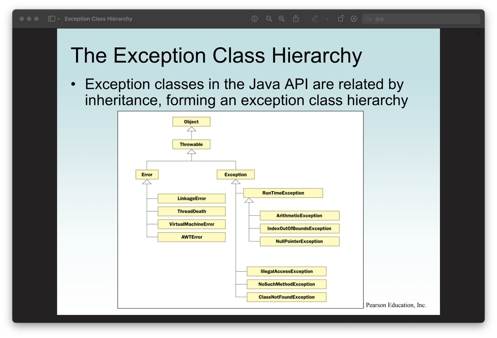

<h2 align=center>Week 12: <em>Day 2</em></h2>

<h1 align=center>Exceptions: <em>The <code>Throwable</code> Class</em></h1>

<p align=center><strong><em>Song of the day</strong>: <a href="https://youtu.be/Vx1Yljmm3ck?si=jmGH0jnILrdNyIBT"><strong><u>そして、次の曲が始まる (And So, The Next Piece Begins)</u></strong></a> by Akito Matsuda (2019)</em></p>

---

### Sections

1. [**Handling Exceptions at Another Place in the Program**](#part-1-handling-exceptions-at-another-place-in-the-program)
2. [**The `Throwable` Class**](#part-2-the-throwable-class)
3. [**IO Exceptions**](#part-3-io-exceptions)

---

### Part 1: _Handling Exceptions at Another Place in the Program_

Our exceptions don't necessarily have to be handled within the method where they occurred. This may be a bit of a confusing concept, but we've actually seen something similar before. Let's say we have the following class:

```java
public class StandardDeviation {
    public double getStandardDeviation(int[] numbers) {
        double standardDeviation = 0.0d;
        double average = getAverage(numbers);

        for(double number : numbers) {
            standardDeviation += Math.pow(number - average, 2);
        }

        return standardDeviation;
    }

    private double getAverage(int[] numbers) {
        return (double) getSum(numbers) / numbers.length;
    }

    private int getSum(int[] numbers) {
        int sum = 0;
        for (int number : numbers) sum += number;

        return sum;
    }
}
```

<sub>**Code Block 1**: A simple standard deviation calculator.</sub>

Let's say we try to use it with an array of integers, but that array object happened to be null? What does the error message look like?

```java
StandardDeviation stdev = new StandardDeviation();

int[] grades = null;

System.out.printf("The standard deviation is %.2f.\n", stdev.getStandardDeviation(grades));
```

Output:

```text
Exception in thread "main" java.lang.NullPointerException: Cannot read the array length because "<local3>" is null
	at exceptions.StandardDeviation.getSum(StandardDeviation.java:29)
	at exceptions.StandardDeviation.getAverage(StandardDeviation.java:24)
	at exceptions.StandardDeviation.getStandardDeviation(StandardDeviation.java:14)
	at exceptions.StandardDeviation.main(StandardDeviation.java:9)
```

You see how the last four lines follow a sort of path through the methods necessary to get the standard deviation? That is:

1. The `main()` calls on the `getStandardDeviation()` method in line 9.
2. The `getStandardDeviation()` method calls on the `getAverage()` method in line 14.
3. The `getAverage()` method calls on the `getSum()` method in line 24.
4. Finally, the `getSum()` method attempts to use the number array in line 29, but since it is `null`, it raises the `NullPointerException` exception.

This is what is called a **method hierarchy**, and it represents the order in which the methods are called in the stack. In other words, since one method is dependent on the other, the "outer method" will be placed on the stack first, followed by the "inner method", and so on and so forth.

So, where exactly should this exception be handled? The answer is that it could be handled at any of these steps—it's really up to the programmer to decide. Since `NullPointerException` exceptions will always first happen in `getSum()` (since they are the first method to even touch the array of integers), it may seem natural to handle it there, but Java provides an alternative way of doing this. For this, it's helpful to look at Java's `Exception` class hierarchy:



<sub>**Figure 1**: The inheritance hierarchy of Java's `Exception` class.</sub>

As you can see, all error and exception classes are descendants of the `Throwable` class. While these are pretty 
extensive, as our projects grow in complexity and specificity, we are bound to want to have our own, project-specific
exceptions. Fortunately, thanks to inheritance, we can extend the `Exception` class and achieve exactly that. Going
back to our `StandardDeviation` class, let's define an exception that has a more specific name, such as 
[**`StandardDeviationNotCalculableException`**](code/StandardDeviationNotCalculableException.java):

```java
public class StandardDeviationNotCalculableException extends NullPointerException {
    public StandardDeviationNotCalculableException(String message) {
        super(message);
    }
}
```

<sub>**Code Block 2**: A simple extension of `NullPointerException`.</sub>

Now, how do we apply this very long-titled exception in practice? You may have noticed that all exceptions extend something called `Throwable`. And that's our bread and butter.

<br>

### Part 2: _The `Throwable` Class_

How, exactly, is an exception triggered? There is no immediately obvious syntax to tell Java to throw its built-in exceptions, so it's hard to tell. However, in Java:

> A method that can trigger an exception is said **to throw an exception**.

For example, our `getSum()` method from earlier can be said to **throw a `NullPointerException`**. Since a large number of Java situations throw this exception, Java doesn't need you to tell it so. For our own custom exceptions, however, we have to explicitly do so. For this, we use the **`throws`** keyword:

```java
private int getSum(int[] numbers) throws StandardDeviationNotCalculableException {
   if (numbers == null || numbers.length == 0) {
      throw new StandardDeviationNotCalculableException("This array is unsuitable for standard deviation " +
              "calculations. Check that it is not null or empty."); 
   }
   
   int sum = 0;
   for (int number : numbers) sum += number;
   
   return sum;
}
```

<sub>**Code Block 2**: Java now knows that `getSum()` can throw our custom 
`StandardDeviationNotCalculableException`.</sub>

As you can see, three things are necessary here:

1. The method signature must include the keyword `throws` followed by the name of the exception.
2. A way of checking whether this exception will be thrown. In this case, a standard deviation cannot be calculated
from a null array nor from an empty one.
3. In order to actually raise this exception, we must use the `throw` keyword followed by an object of that exception
class.

This is what is called a **checked** exception, i.e. an exception that must be explicitly checked for in order for it
to be thrown. Some built-in Java exceptions, such as `ArithmeticExcpetion` objects, are **unchecked**, since they are
raised regardless of whether we check them or not.

Checked exceptions include:

- **`ClassNotFoundException`**: Thrown when an application tries to load in a class but no definition for the class with
the specifed name could be found.
- **`IOException`**: Produced by failed or interrupted I/O operations, such as opening files.
- **`SQLException`**: Thrown when an [**SQL 
Server**](https://www.yourofficeanywhere.co.uk/info-hub/what-is-sql-server/) returns a warning or error.

Unchecked exceptions include:

- **`ArithmeticException`**: Thrown when an exceptional arithmetic condition has occurred. For example, a number 
divided by zero throws an instance of this class.
- **`ArrayStoreException`**: Thrown to indicate that an attempt has been made to store the wrong type of object into an 
array of objects (for example, trying to store a `double` in an `int` array).
- **`ClassCastException`**: Thrown to indicate that the code has attempted to cast an object to a subclass of which it 
is not an instance (for example, trying to cast a `String` object into a `byte`).

---

One final thing that you should watch out for is the following situation:

```java
System.out.println("Before throw");

throw new OutOfRangeException("Too High");

System.out.println("After throw");
```

<sub>**Code Block 3**: In which situations does this exception get thrown?</sub>

Because we don't actually check for a situation where an `OutOfRangeException` might happen (say, with an 
`if`-statement), this exception will **always** be thrown, regardless of the situation, which is most certainly not
what we want.

<br>

### Part 3: _IO Exceptions_

We talked about JavaFX being an extension to our current knowledge in the sense that it provides a visual output to our
programming. Of course, these inputs and outputs don't always have to be visual, and oftentimes take the form of files
that are created / edited. In order to do this with Java, we need to take advantage of something called a _stream_.

> A **stream** is a sequence of bytes that flow from a source to a destination. In a program, we read information from 
> an input stream and write information to an output stream. A program can manage multiple streams simultaneously.

There are three standard I / O streams:
- **Standard Output**, which is defined by `System.out`.
- **Standard Input**, which is defined by `System.in`.
- **Standard Error**, which is defined by `System.err`.

We've naturally seen `System.out` a whole bunch. Both it and `System.err` typically represent the console window. 
`System.in` on the other hand typically represents keyboard input, which we've used many times with `Scanner` objects.

---

It probably goes without saying that the user can input all sorts of garbage values into a program. This is not 
necessarily done on purpose; users have to learn how to use a program, and the learning curve for any given program
can vary from person to person. This being the case, it helps for us to to have a specific exception that deals with
these unpredictable scenarios. The `IOException` class—a **checked** exception—deals with such operations performed by 
some of Java's I / O classes.

For example, it's helpful in situations when:

- A file might not exist
- A file exists, but the program is not able to find / open it
- The file exists, can be found and opened, but does not contain the kind of data that we expect (e.g. tryng to open
a Word file with Apple Music or Spotify)

Let's illustrate this by writing some data onto a file using the `PrintWriter` class. In this case, this output stream
must be closed explicitly—a good use for our `finally` clause:

```java
import java.io.IOException;
import java.io.PrintWriter;
import java.util.Random;

public class TestData {
    public static final int MAX = 10;
    public static final String FILE_NAME = "test.txt";

    public static void main(String[] args) throws IOException {
        int value;

        // Our output stream is no long System.out, but a PrintWriter object
        PrintWriter outFile = new PrintWriter(FILE_NAME);

        Random random = new Random();

        for (int lineNumber = 1; lineNumber <= MAX; lineNumber++) {
            for (int number = 1; number <= MAX; number++) {
                value = random.nextInt(90) + MAX;
                outFile.printf("%d\t", value); // The same methods—print(), printf(), println()—are available to us
            }

            outFile.print('\n');
        }

        outFile.close();
        System.out.printf("Output file has been created: %s!\n", FILE_NAME);
    }
}
```

<sub>**Code Block 4**: Delegating the `IOException` to the caller of `main()`.</sub>

Or, if you want to handle the exception _in-situ_:

```java
import java.io.IOException;
import java.io.PrintWriter;
import java.util.Random;

public class TestData {
    public static final int MAX = 10;
    public static final String FILE_NAME = "test.txt";

    public static void main(String[] args) {
        int value;

        try {
            // Our output stream is no long System.out, but a PrintWriter object
            PrintWriter outFile = new PrintWriter(FILE_NAME);

            Random random = new Random();

            for (int lineNumber = 1; lineNumber <= MAX; lineNumber++) {
                for (int number = 1; number <= MAX; number++) {
                    value = random.nextInt(90) + MAX;
                    outFile.printf("%d\t", value); // The same methods—print(), printf(), println()—are available to us
                }

                outFile.print('\n');
            }

            outFile.close();
            System.out.printf("Output file has been created: %s!\n", FILE_NAME);
        } catch (IOException ioe) {
            System.out.println("ERROR: Something went wrong.");
        }
    }
}
```

<sub>**Code Block 5**: Catching the exception inside of `main()`.</sub>