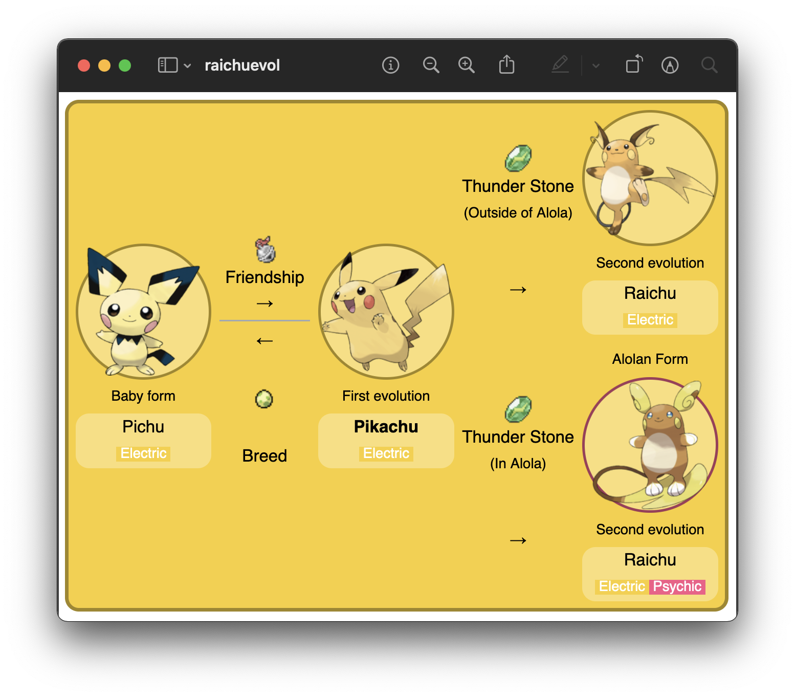

## Lecture 13

# Collections

### 17 Thermidor, Year CCXXX

### Sections

1. [**Collections**](#part-1-collections)
2. [**Object References / Pointers**](#part-2-object-references--pointers)
3. [**Dynamic Linked-List**](#part-3-dynamic-linked-list)

### Part 1: _Collections_

Today, we're going to learn about collections. These are actually pretty nice—we're reaching a point in our Java journey
where we're equipped with enough knowledge to use more abstract and complex structures. Let's take a look at what these
are.

---

A **collection** is an object that serves as a repository for other objects. Generally speaking, all Java collections
provide services for adding, removing, and managing the elements it contains. Depending on the collection type, these
elements may or may not be ordered—choosing which collections to use in a given situation is up to you and what you 
think is most useful.

These collections are what we call **generic**, which means that we are not limited to which type of data you store in
them. For example, you can create an `ArrayList` collection that can store, `int` objects, one that can create `String`
objects, and one than can store `Pokemon` objects.

```java
ArrayList<Integer> integers = new ArrayList<Integer>();
ArrayList<String> strings   = new ArrayList<String>();
ArrayList<Pokemon> pokemon  = new ArrayList<Pokemon>();
```

<sub>**Code Block 1**: Here, the same collection type has been instantiated to store three different types of objects.
This is what we mean by _generic_.</sub>

So what is, exactly, an `ArrayList`? All Java collections are implemented with a particular underlying data structure;
in the case of `ArrayList`, this data structure is a [**linked-list**](https://en.wikipedia.org/wiki/Linked_list), which
you can think of as a chain with each of its links containing a single data point of a certain type.


<sub>**Figure 1**: A linked-list of integers.</sub>

In the case of `ArrayList`, this linked-list is what we call **dynamic** (that is, unlike regular Java array, they can
grow, shrink, and change after they have been instantiated).

We generall say that collections are **abstractions** of pre-existing data structures—that is, they abstract away 
behaviour from the user so that we don't have to worry about it; we can just use them. Another term for this is 
**abstract data type**: an organized collection of information and a set of operations used to manage that information.

### Part 2: _Object References / Pointers_

Let's say you wanted to maintain a list of Pokémon with information for their name, types, level, and _the Pokemon 
object to which they [**evolve**](https://bulbapedia.bulbagarden.net/wiki/Evolution)_. This implies that one `Pokemon`
object would contain an object of the `Pokemon` class inside it. 

```java
import java.util.ArrayList;

public class Pokemon {
    private final String name;
    private final ArrayList<String> types;
    private final int level;
    private final Pokemon evolution;

    public Pokemon(String name, ArrayList<String> types, int level, Pokemon evolution) {
        this.name = name;
        this.types = types;
        this.level = level;
        this.evolution = evolution;
    }
}
```

<sub>**Code Block 2**: The `Pokemon` class containing a reference to another `Pokemon` object.</sub>

It turns out that the ideal structure for something like this is a linked-list as well. After all, linked-lists are 
collections of links in a chain—and if we have a chain of Pokémon evolution, then this is exactly what we're looking 
for. This `this.pokemon` variable is what we call an **object reference**—that is, it stores the _address of the next
Pokémon down the chain_. 

Think of this as a military or corporate system whereby, if I asked any given individual who
their superior was, they would be able to **point me to them**. Because this analogy is so close to what the data 
structure is doing, we call these references ***pointers*** in computer science.

```text
 +———————————+             +———————————+             +———————————+
 | Pichu     |      +----> | Pikachu   |      +----> | Raichu    |
 +———————————+      |      +———————————+      |      +———————————+
 | Electric  |      |      | Electric  |      |      | Electric  |
 | 5         |      |      | 25        |      |      | 50        |
 | Pikachu   | -----+      | Raichu    | -----+      | null      |
 +———————————+             +———————————+             +———————————+
```

<sub>**Figure 2**: A visual representation of a linked-list of `Pokemon` objects. Notice that, since Raichu doesn't 
evolve to another Pokémon, its `evolution` pointer doesn't point to anything (i.e. it points to `null`).</sub>

We could, therefore, do something like this:

```java
Pokemon raichu = new Pokemon("Raichu", new String[] { "Electric" }, 50, null);
Pokemon pikachu = new Pokemon("Pikachu", new String[] { "Electric" }, 25, raichu);
Pokemon pichu = new Pokemon("Pichu", new String[] { "Electric" }, 5, pikachu);

System.out.println(pichu.getEvolution().getEvolution().getName());
```

<sub>**Code Block 3**: Printing the name of the evolution of the evolution of `pichu`.</sub>

Output:

```text
Raichu
```

### Part 3: _Dynamic Linked-List_

Now, the problem here is that unfortunately, our linked-list is completely static; because of the `final` qualifier in
front of `evolution`, we cannot change the list at all. This is a problem for us, since the Pokémon Company constantly
releases new evolution / new versions of evolutions with every game. For example, Pikachu can now evolve to both Raichu
or to Alolan Raichu depending on the game:



<sub>**Figure 3**: The Pichu evolutionary chain. 
[**Source**](https://bulbapedia.bulbagarden.net/wiki/Pikachu_(Pok%C3%A9mon)#Evolution) </sub>

We need, therefore a way of making our chain _mutable_. Let's remove the `final` qualifier and add some more 
functionality to our `Pokemon` class:

```java
public class Pokemon {
    private final String name;
    private final String[] types;
    private final int level;

    private Pokemon evolution;

    public Pokemon(String name, String[] types, int level) {
        this.name = name;
        this.types = types;
        this.level = level;
        this.evolution = null;
    }

    public void changeEvolution(Pokemon newEvolution) {
        this.evolution = newEvolution;
    }
}
```
```java
Pokemon raichu = new Pokemon("Raichu", new String[] { "Electric" }, 50);
Pokemon pikachu = new Pokemon("Pikachu", new String[] { "Electric" }, 25);
Pokemon pichu = new Pokemon("Pichu", new String[] { "Electric" }, 5);

pichu.changeEvolution(pikachu);                 // Change Pichu's evolution
pichu.getEvolution().changeEvolution(raichu);   // Change Pichu's evolution's evolution

Pokemon alolanRaichu = new Pokemon("Alolan Raichu", new String[] { "Electric", "Psychic"}, 50);
pichu.getEvolution().changeEvolution(alolanRaichu);  // Change Pichu's evolution's evolution again

System.out.println(pichu.getEvolution().getEvolution().getName());
```

<sub>**Code Block 4**: Calling `Pokemon` methods of `Pokemon` objects inside other `Pokemon` objects. In other words, 
we're calling `raichu` methods via `pikachu`, which is being referenced by `pichu` using `getEvolution()`.</sub>

What if we wanted write a method that prints out the entire evolutionary chain of a single Pokémon, starting with the
Pokémon itself?

```java
public void printEvolutionaryChain() {
    Pokemon current = this; // Create a separate reference to the current object

    do {
        System.out.printf("%s", current.name);  // Print its name
        current = current.getEvolution();       // And change the value of the reference to the next evolution

        if (current != null) System.out.print(" -> ");  // For formatting
    } while (current != null);  // Repeat this until there is no evolution left
}
```

<sub>**Code Block 5**: Printing a linked-list is a very common algorithm asked in interview questions.</sub>

We can also do this recursively, since we have the base step of `current != null`!

```java
public static void printEvolutionaryChainRecursively(Pokemon first) {
    if (first == null) return;  // If the current pokemon is null, then we're done

    System.out.printf("%s", first.getName()); // If not, print its name
    if (first.getEvolution() != null) System.out.print(" -> "); // And an arrow if it has another evolution

    printEvolutionaryChainRecursively(first.getEvolution());  // Recursive step
}
```

<sub>**Code Block 6**: Recursive version of code block 5.</sub>

```java
pichu.printEvolutionaryChain();
Pokemon.printEvolutionaryChainRecursively(pichu);
```

Both of these print:

```text
Pichu -> Pikachu -> Alolan Raichu
```