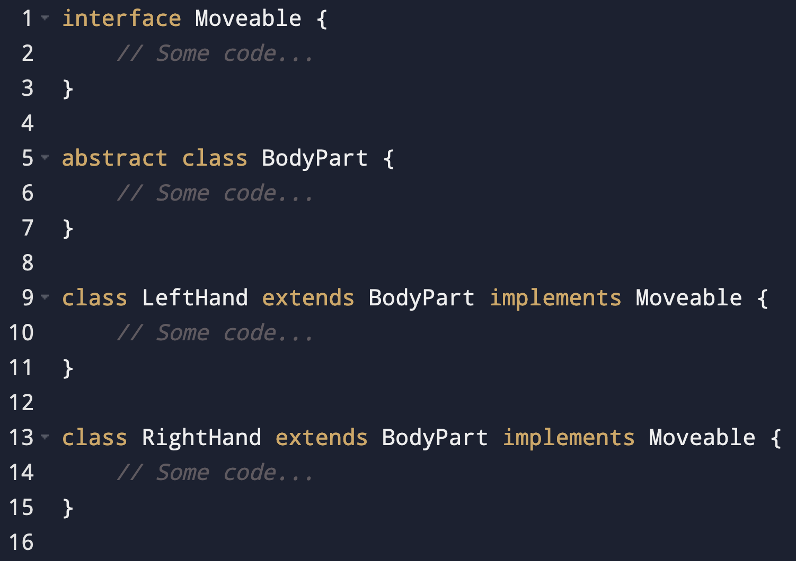
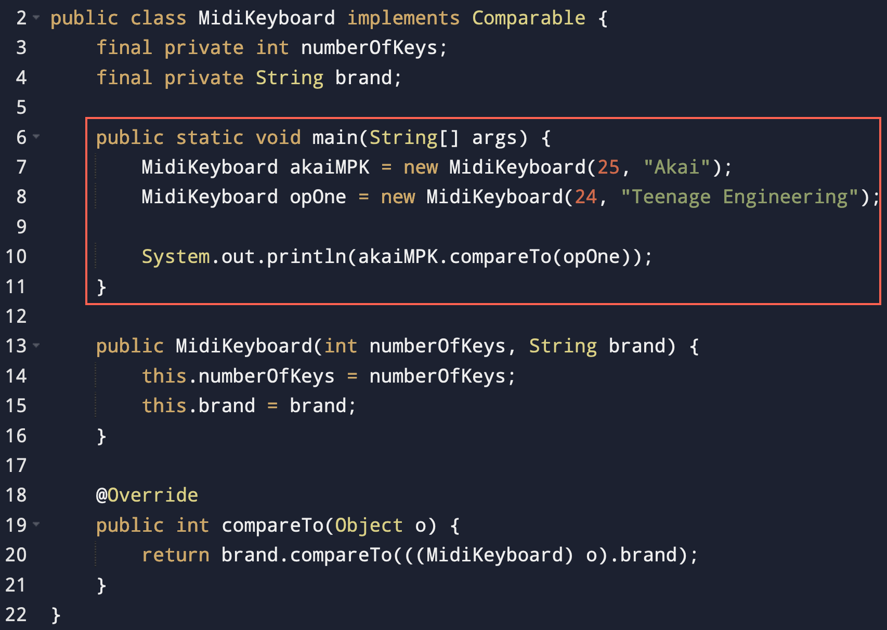
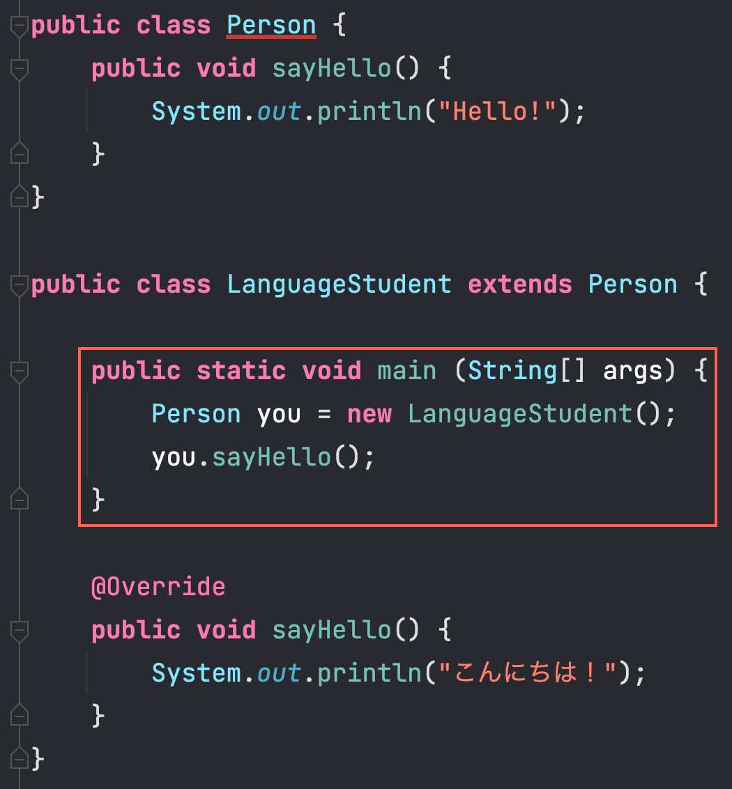

### CS 122

# Exam 1

#### Due Thursday, July 7th, at 6:10pm via email for 100 points.

### How To Submit

Your submission must be comprised of three files:
1. `multipleChoice.txt` containing your answers to all the multiple choice questions from part 1.
2. `ReadingMaterial.java` and `ComicBook.java` containing your implementations of part 2.

> ***Please email them to me before 6:10pm to both [**scruz3@pace.edu**](scruz3@pace.edu) and 
> [**src402@nyu.edu**](src402@nyu.edu) to avoid submission issues on Classes.***

I recommend that you email me what you have, regardless of whether you are finished or not, at 6:00pm to make sure that
you have at least _something_ submitted.

### Sections

1. [**Multiple Choice**](#multiple-choice) _(60 pts)_
    1. [**Concepts**](#concepts-2-pts-each) _(30 pts)_
    2. [**Implementation**](#implementation-6-pts-each) _(30 pts)_
2. [**Programming**](#programming-40-pts) _(40 pts)_

## Multiple Choice

### Concepts (2 pts each)

1. Providing a class the ability to call the same method using multiple different signatures is called:
    - **a.** Method overriding
    - **b.** Parameter switching
    - **c.** Method overloading
    - **d.** Parameter overloading
    - **e.** Attribute overriding


2. What kind of relationship does a child class have with its parent class?
    - **a.** "_equals-a_" relationship
    - **b.** "_implements-a_" relationship
    - **c.** "_secedes-a_" relationship
    - **d.** "_is-a_" relationship
    - **e.** "_needs-a_" relationship


3. Binary search makes searching faster by:
    - **a.** picking a random starting point for the search
    - **b.** splitting the search roughly in half, making it an O(n/2) time algorithm
    - **c.** deleting half of the elements in the array from memory
    - **d.** splitting each **pass** of the search roughly in half
    - **e.** sorting the list first


4. You cannot create objects of an abstract class unless...
    - **a.** There is no "unless"; Abstract classes cannot create objects
    - **b.** you make all of its methods abstract as well
    - **c.** you provide an implementation for all of its methods
    - **d.** it is implementing an interface
    - **e.** you remove the `abstract` keyword


5. If a child class overrides one of its parent's methods, which version of the method will be executed by an object of
the child class?
    - **a.** The child's
    - **b.** The parent's
    - **c.** It gets picked randomly
    - **d.** The child's, but only if the child implements the `Comparable` interface
    - **e.** The parent's, since it is older


6. The `protected` modifier differs from the `private` modifier in that it...
    - **a.** is only allowed in abstract classes
    - **b.** allows interfaces to use it
    - **c.** allows child classes of the current class to use it
    - **d.** is only allowed by objects with a polymorphic reference type different to its own type
    - **e.** allows its sibling classes to use it


7. It is only possible to create an array of objects that are of different types if...
    - **a.** you use Python instead of Java
    - **b.** they are polymorphic siblings
    - **c.** you cast them into the exact same type
    - **d.** they are either `int`s or `double`s
    - **e.** There is no "if". It's impossible.


8. If a class implements an interface, it _must_ implement its methods.
    - **a.** True. Interfaces don't provide an implementation, after all
    - **b.** True. Otherwise you can't compare two objects of the same type
    - **c.** False. But only if that class is abstract
    - **d.** False. Implementing interface methods is completely optional
    - **e.** False. You can just use the interface's implementation of that method


9. Selection sort differs from insertion sort in that...
    - **a.** It only works with numbers
    - **b.** It is ten times faster
    - **c.** It sorts in a different way
    - **d.** It only works with objects that implement the `Comparable` class
    - **e.** They don't. They are just different names for the same algorithm


10. Which of the following modifiers cannot be placed in the signature of an abstract method? (Think of what being 
abstract _means_)
    - **a.** `private`
    - **b.** `public`
    - **c.** `protected`
    - **d.** `void`
    - **e.** `final`

### Implementation (6 pts each)

1. Consider the following implementation:  Which of the following array instantiations would be 
allowed?
   - **a.** `LeftHand[] hands = new LeftHand[] { new LeftHand(), new RightHand() };`
   - **b.** `BodyPart[] hands = new BodyPart[] { new LeftHand(), new RightHand() };`
   - **c.** `Moveable[] hands = new Moveable[]  { new LeftHand(), new RightHand() };`
   - **d.** `RightHand[] hands = new RightHand[] { new LeftHand(), new RightHand() };`
   - **e.** Both **b** and **c**


2. Consider the following implementation:  When the `main()` (the code in the red square) is run, what
will be printed on the console?
   - **a.** A positive number
   - **b.** A negative number
   - **c.** Zero
   - **d.** `true`
   - **e.** `false`


3. Consider the following implementation:  When the `main()` (the code in the red square) is run, what
   will be printed on the console?
   - **a.** `"Hello!"`
   - **b.** `"Hola!"`
   - **c.** Nothing. This will not compile
   - **d.** `"こんにちは！"`
   - **e.** It will randomly print either **b** or **d**


4. Which methods can be overriden from the `Object` class?
   - **a.** `compareTo()`
   - **b.** `toString()`
   - **c.** `sort()`
   - **d.** `equals()`
   - **e.** Both **b** and **d**.


5. Which methods can be overloaded?
   - **a.** All methods.
   - **b.** Only constructors.
   - **c.** All methods except for constructors.
   - **d.** Only methods that are part of the class in question.
   - **e.** `final` methods only.

## Programming (40 pts)

For this exercise you will be designing an object-oriented system composed of the following hierarchy:

```text
  ReadingMaterial.java
         |
         | extends...
         |
         v
    ComicBook.java     
```

That is...

> **`ReadingMaterial.java`** contains **an abstract class called `ReadingMaterial`**, and **`ComicBook`** contains 
> **a public class called `ComicBook`** that extends `ReadingMaterial`.

The requirements for `ReadingMaterial` are:
   - An integer instance variable, called `pageNumber`, representing the number of pages in this reading material. Make
sure that child classes of `ReadingMaterial` can also have access to this variable. (Hint: there's a specific access 
modifier that does this job)
   - A single method belonging to the `ReadingMaterial` class. This method may be called anything that you want. This 
method must be abstract.

The requirements for `ComicBook` are:
- An implementation that meets the requirements of being a child class of `ReadingMaterial`.
- A `String` instance variable belonging to `ComicBook` called `title`, representing the title of the comic book.
- An implementation that allows `ComicBook` objects to be **searchable and sortable by the contents of `title`**. You 
may assume that the objects that it is being compared to are not `null`. (Hint: There's a specific interface that you
have to use here).
- Two `ComicBook` objects are equal when their `title` attributes are equal. (Hint: there's a specific method that you
have to override here)

For example, The following code must be able to run without errors and result in the `comics` array being sorted:

```java
ComicBook akira = new ComicBook(100, "Akira");
ComicBook mieruko = new ComicBook(76, "Mieruko");

ReadingMaterial[] comics = new ReadingMaterial[] { mieruko, akira };
Arrays.sort(comics);
```

> ***Please email your submission to me before 6:10pm to both [**scruz3@pace.edu**](scruz3@pace.edu) and
> [**src402@nyu.edu**](src402@nyu.edu) to avoid submission issues on Classes.***