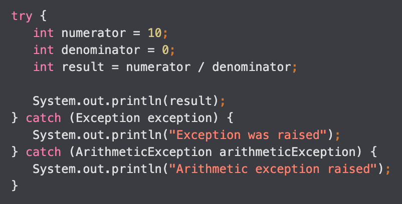
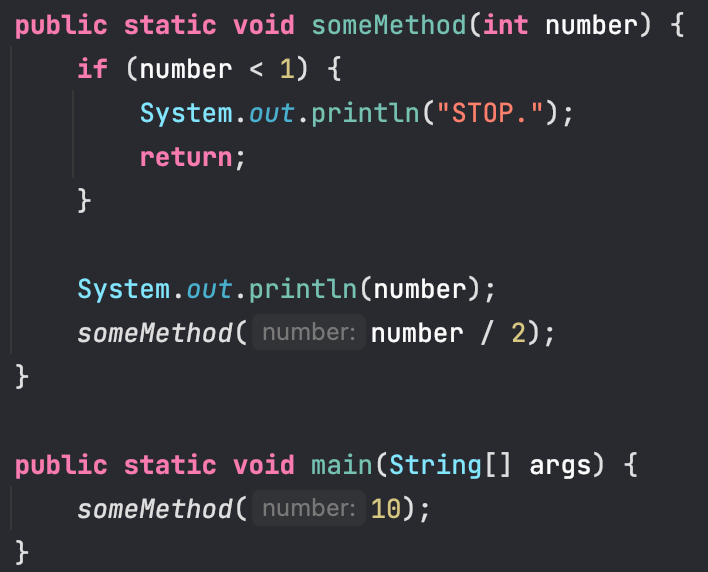
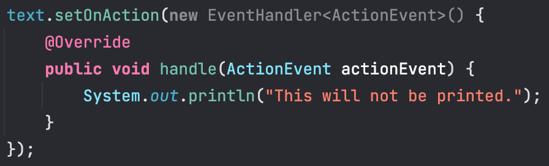
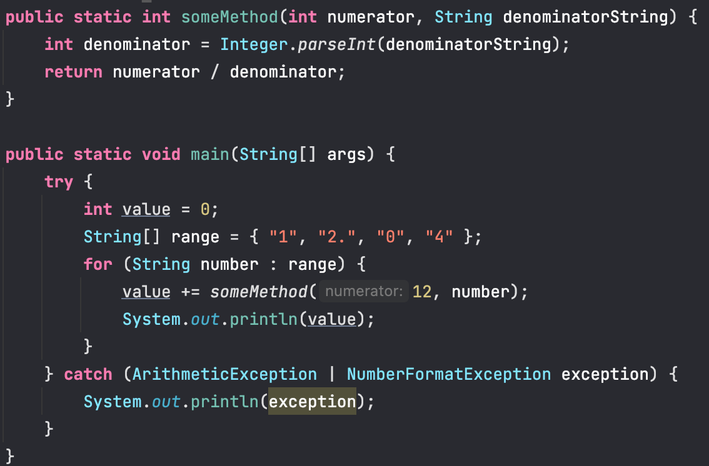
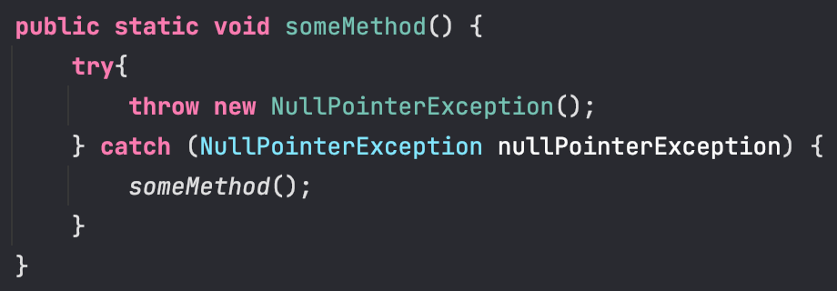

### CS 122

# Exam 2

#### Due Monday, August 1st, at 6:10pm via email for 100 points.

### How To Submit

Your submission must be comprised of **two** files:
1. `multipleChoice.txt` containing your answers to all the multiple choice questions from part 1.
2. `ExamTwo.java` containing your implementation of part 2.

> ***Please email them to me before 6:10pm to both [**scruz3@pace.edu**](scruz3@pace.edu) and
> [**src402@nyu.edu**](src402@nyu.edu) to avoid submission issues on Classes.***

I recommend that you email me what you have, regardless of whether you are finished or not, at 6:00pm to make sure that
you have at least _something_ submitted.

### Sections

1. [**Multiple Choice**](#multiple-choice) _(70 pts)_
    1. [**Concepts**](#concepts-25-pts-each) _(50 pts)_
    2. [**Implementation**](#implementation-4-pts-each) _(20 pts)_
2. [**Programming**](#programming-40-pts) _(30 pts)_

### Multiple Choice

#### Concepts (2.5 pts each)


1. All Java errors are exceptions.
   1. True
   2. True, but only in situations where the IO is not the Terminal/Command Line
   3. True, unless the user doesn't use `try`-`catch`
   4. False. There are Java errors that are not considered exceptions
   5. False, unless the user creates a custom class to handle these non-exception errors


2. JavaFX considers the origin to be...
   1. 0.0, 0.0
   2. The top left corners of the screen
   3. A set of two non-zero positive values
   4. Options 1, 2, and 3
   5. Options 1 and 2


3. Algorithms that utilise `for`- and `while`-loops are, unlike recursive algorithms, known as...
   1. Inefficient algorithms
   2. Incursive algorithms
   3. Soft algorithms
   4. Selection algorithms
   5. Iterative algorithms


4. When designing software, the programmer should...
   1. Assume that the user will always enter the correct input; all errors are the fault of the programmer
   2. Assume that the hardware running this piece of software will never fail, so only user-caused errors should be 
   handled
   3. Assume that both the user and the hardware will never fail at the same time
   4. Assume that any situation that can go wrong will, at some point, go wrong—so every error that can be handled 
   should be handled
   5. Consider errors to be rare


5. If a JavaFX group contains a square, a circle, and an ellipse with their centres in the same location, which of the 
three shapes would appear as being "on top" to the user?
   1. The square
   2. The circle
   3. The ellipse
   4. Neither; an exception will be raised
   5. It depends on the order in which the shapes were placed inside the group


6. Recursive algorithms have two steps—their base case, and their recursive step. The base case is...
   1. The step where the algorithm will stop calling itself and go back the call stack
   2. The step where the algorithm will return the final answer
   3. The step where the algorithm will call itself a final time
   4. The step where the algorithm will throw a `RecursionException` in order to signal the end of the recursive step
   5. Options 1, 2, and 4


7. If an exception is raised at any point during the execution of a Java program, which of these is not a valid way of
catching and handling the exception?
   1. By ignoring the error and hoping that it never happens
   2. By asking the Oracle servers to scan our code to catch and handle any potential error
   3. By catching and handling it within the method that the exception occurred
   4. By catching and handling it within a method higher in the method hierarchy
   5. All of these are valid ways of handling errors


8. In order to translate multiple JavaFX shapes at once, the user must...
   1. Place them in the same group and then only translate the group
   2. Translate each shape individually
   3. Create them in their desired position from the beginning
   4. Surround them in a `move`-`catch` block
   5. Show the scene first, and drag each object to the desired location


9. How many base cases do recursive algorithms have?
    1. They can only have one
    2. They can have either one or two
    3. They can, in theory, have as many as the algorithm requires as long as the recursive step leads to any of them
    4. As a rule, they don't have any. Adding base cases is discouraged


10. The `try`-`catch` structure can catch and handle how many errors in one single implementation?
    1. As many as the programmer includes using the pipe (`|`) character
    2. As many as the programmer includes as long as they are or inherit from the `IOException` class
    3. As many as the JVM can compile in one go, which depends on how much RAM the hardware has
    4. Only one
    5. As many as the programmer includes using the pipe (`|`) character, but it's best practice handling only one 
    exception per `try`-`catch` block

11. JavaFX colours must be represented using...
    1. RGB values
    2. Static values from the `Color` class (e.g. `Color.RED`)
    3. The `Color` class's `color()` method
    4. Either 1, 2, or 3
    5. 1, 2, and 3 at the same time


12. Which of the following statements is true?
    1. Any iterative method can be converted into a recursive method
    2. Recursive methods take more time and memory to execute than iterative methods
    3. Recursive methods are *always* simpler than non-recursive methods
    4. There is always an `if`-statement in a recursive method to check whether a base case is reached
    5. None of the above are true


13. If a type of exception can be raised during the execution of a method, but the programmer prefers the exception to
be handled further up the method hierarchy, it is absolutely necessary to include the `throws` keyword in the method's 
signature.
    1. True. Otherwise, the method has no way of communicating with the others in the hierarchy
    2. False. It is only necessary with checked exceptions
    3. False. `throws` is only a convention and is not strictly necessary
    4. True. Both checked and unchecked exceptions must absolutely be specified by the signature in order for any method
    in the hierarchy to catch them
    5. False. It is only necessary with `ArithmeticException` instances


14. Which of the following are not valid ways of defining an event handler?
    1. A lambda expression
    2. A separate file that implements the `EventHandler` interface
    3. A private inner class that implements the `EventHandler` interface
    4. A `try`-`catch` block that catches event handlers instead of exceptions
    5. None of the above are valid ways of defining an event handler


15. What happens if one forgets to add the base case in a recursive method?
    1. In theory, the method will not run
    2. In theory, the method will run infinitely
    3. In theory, the method should still return a value
    4. In theory, the method will cause the end of the world
    5. In theory, the program will raise an `IOException`


16. Attempting to open and use a `.txt` file when an `.mp3` file was expected will lead to...
    1. A heavy fine of $1,000,100.00
    2. An `ArithmeticException` being raised
    3. The program crashing no matter what
    4. An `IOException` being raised
    5. The `.mp3` file being opened as a `.txt` file with its contents rendered in binary


17. Recursive programs cannot contain `try`-`catch` blocks because...
    1. The method call will be too large for the JVM to keep up with it
    2. This is untrue. There is no reason why recursive programs can't handle exceptions
    3. It will make them unnecessarily slow
    4. Methods that call themselves cannot contain the `throws` keyword
    5. Recursive methods can't perform actions that raise any exceptions, therefore, there is no need for them


18. What should a programmer do if their program contains a dangerous situation which is not covered by Java's 
pre-existing classes?
    1. Create their own exception by inheriting from the `Error` class
    2. Create their own exception by implementing the `Throwable` interface
    3. Create their own exception by inheriting the `Throwable` class
    4. Throw the `Exception` class in these situations—nothing more specific should be done


19. A `TextField` fires an action event when:
    1. Clicking the `A` key
    2. A mouse click is registered
    3. The user types something into it
    4. The `Enter` key is clicked
    5. The `TextField` class does not listen for events


20. The code in the `finally` block is executed...
    1. Always
    2. If the code inside the `try`-block doesn't fail
    3. If the code inside the `try`-block fails
    4. If a `FinallyException` is caught and handled
    5. Never

#### Implementation (4 pts each)

1. Consider the following code:
What will be printed onto the console?
   1. `0`
   2. `Exception was raised`
   3. `Arithmetic exception raised`
   4. An unhandled error message
   5. Nothing


2. Consider the following code:
What will be printed onto the console when the `main()` method is called?
   1. Nothing, there will be an error
   2. `STOP`
   3. `10`, `5`, `2`, `1`, `STOP.`
   4. `1`, `5`, `2`, `10`, `STOP.`
   5. `1`, `5`, `2`, `10`


3. Consider the following JavaFX code:
What is the appropriate way to express this same code with a lambda expression?
   1. `text.setOnAction(actionEvent -> System.out.println("This will not be printed."));`
   2. `text.setOnAction(handle(ActionEvent actionEvent) == System.out.println("This will not be printed."));`
   3. `text.setOnAction(this::processEvent);`
   4. It cannot be converted into a lambda expression
   

4. Consider the following code:
How many lines of code will be printed (not counting `Process finished with exit code 0`)?
   1. One line
   2. Two lines
   3. Three lines
   4. Four lines
   5. However long the error message is


5. Consider the following code:
How many times will this method run before throwing a `NullPointerException` if called?
   1. Once
   2. At least twice
   3. An infinite amount of times
   4. It depends on how many times your computer runs it before running out of RAM
   5. The code doesn't run at all
   
#### Programming

Write a **recursive** method that will count the amount of times that a given character appears in a string. This method
must have the following signature:

```java
public static int countCharacters(String string, char character)
```

That is, we are returning the amount of times that `character` appears in `string`. So, for example, if we ran the 
following code:

```java
String string = "MOS MCS 6502 1975";
System.out.println(countCharacters(string, '5'));
```

We would see the following output in our console:

```text
2
```

Hints:
1. You could consider a string to simply be an array of `char` values. That is, you could apply our array head and tail 
strategy with a string as well (like we did with the sum of an array of numbers, for example).
2. Remember that `Strings` can be null. You should let the caller of the function know if they've passed in a null 
string with an appropriate exception.
3. The following `String` methods may be helpful:
   1. **`charAt(int index)`**: returns the character (a `char` value) at index `index` of a string.
   2. **`length()`**: returns the length of a string.
   3. **`substring(int startingPoint)`**: Returns a substring with all the characters of the calling string starting at
   index `startingPoint`. For example, if the string is equal to `"Hello"` and we print `string.substring(2)`, we will
   see the substring `"llo"`.

Write your method inside a class called `ExamTwo`.

---

Your submission must be comprised of **two** files:
1. `multipleChoice.txt` containing your answers to all the multiple choice questions from part 1.
2. `ExamTwo.java` containing your implementation of part 2.

> ***Please email them to me before 6:10pm to both [**scruz3@pace.edu**](scruz3@pace.edu) and
> [**src402@nyu.edu**](src402@nyu.edu) to avoid submission issues on Classes.***

I recommend that you email me what you have, regardless of whether you are finished or not, at 6:00pm to make sure that
you have at least _something_ submitted.