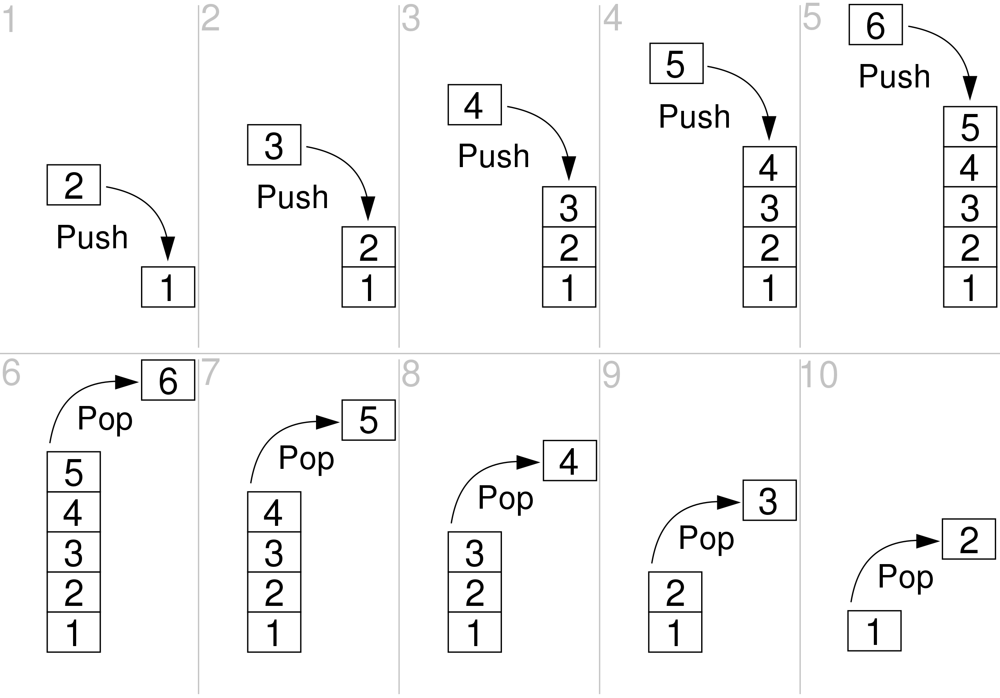

### CS 122

# Homework 4

_Due Friday, August 12th, 11:59pm, on Classes_

## Building a Stack

A [**stack**] is a [**first-in-last-out (FILO)**], linked-list-based data structure essentially behaves the same way 
that a stack of flat objects in real life do. If you have a stack of plates, the one that you placed first (that is, 
the plate at the bottom) is the last to be removed, since the ones on top of it are picked first.



<sub>**Figure 1**: Adding and removing nodes (in this case, containing integers) from a stack.</sub>

An incomplete implementation of a stack, along with its corresponding [**nodes**](Node.java) has been provided for you:

```java
// Stack.java
public class Stack {
    private Node top;
    private int size;

    public Stack(int firstValue) {
        this.top = new Node(firstValue);
        this.top.setPrevious(null);
        this.size = 1;
    }

    public Stack() {
        this.top = null;
        this.size = 0;
    }
    
    public void addToStack(int value) {
        // TODO - Implement add to stack method
    }
    
    public Node removeFromStack() {
        // TODO - Implement remove from stack method

        return null;
    }

    public void printStack() {
        if (this.size == 0 || this.top == null) return;

        Node current = this.top;

        System.out.print("TOP | ");

        do {
            System.out.print(current);
            current = current.getPrevious();

            if (current != null) System.out.print(" <-> ");
        } while (current != null);

        System.out.println(" | BOTTOM");
    }
}
```

<sub>**Code Block 1**: Your starting point. Note that the only two instance attributes of the `Stack` class are a 
reference to the top node of the stack (`top`), and the current size of the stack (`size`).</sub>

You don't need to worry about how the `Node` class is implemented. All you need to know is that it has the following
methods available to it:

- **`public int getValue()`**: Returns the integer value of the calling node.
- **`public Node getNext()`**: Returns a reference to the `Node` object following it in a list. Can be `null`.
- **`public Node getPrevious()`**: Returns a reference to the `Node` object preceding it in a list. Can be `null`.
- **`public void setNext(Node node)`**: Assigns the calling node's `next` (in a list) reference to `node`.
- **`public void setPrevious(Node node)`**: Assigns the calling node's `previous` (in a list) reference to `node`.
- **`public String toString()`**: Returns the calling node's integer value as a string.

Using the class in code block 1, as well as the `Node` class:

1. Implement an **`addToStack(Node node)`** public void method, which will add the `Node` object `node` to the top of 
the stack. This method must take into account the possibility of the stack currently being empty, in which case the f
irst `Node` object to be added will have a `previous` value of `null`. Remember to:
   1. Change the `top` pointer to the new top node.
   2. Increase the `size` integer.
2. Implement a **`removeFromStack()`** method, which returns a `Node` object reference to the stack's old top node. This 
method must take into account the possibility of the stack currently being empty (i.e. `size` is `0` / `top` is `null`),
in which case return `null`. Remember to:
   1. Change the `top` pointer to the new top node.
   2. Decrease the `size` integer.
   3. Sever the ties of the old top node to the stack before returning it.
   4. Return the old top node.

If properly implemented, the following test code:

```java
Stack stack = new Stack();
stack.printStack();

System.out.printf("Adding %d...%n", 7);
stack.addToStack(7);

System.out.printf("Adding %d...%n", 11);
stack.addToStack(11);

System.out.printf("Adding %d...%n", 42);
stack.addToStack(42);

System.out.printf("Adding %d...%n", 14);
stack.addToStack(15);

System.out.printf("Adding %d...%n", 9);
stack.addToStack(9);

stack.printStack();

System.out.printf("Removing %d...%n", stack.removeFromStack().getValue());
System.out.printf("Removing %d...%n", stack.removeFromStack().getValue());

System.out.printf("Adding %d...%n", 0);
stack.addToStack(0);

stack.printStack();
```

Should print the following:

```text
Adding 7...
Adding 11...
Adding 42...
Adding 14...
Adding 9...
TOP | 9 <-> 15 <-> 42 <-> 11 <-> 7 | BOTTOM
Removing 9...
Removing 15...
Adding 0...
TOP | 0 <-> 42 <-> 11 <-> 7 | BOTTOM
```