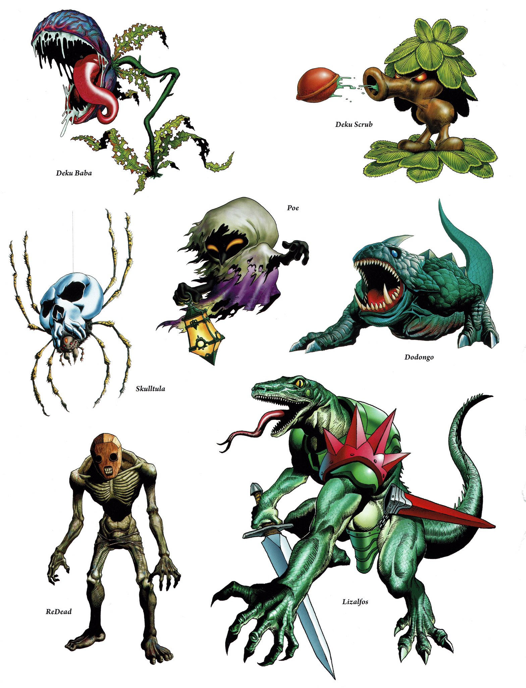
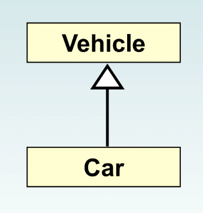

## Lecture 01

# Inheritance

***Song of the day***: _[**Coming Up**](https://youtu.be/g5nzLQ63c9E) by Paul McCartney (1980)._

---

Today we're going to be talking about the concept of **inheritance**. Fundamentally, inheritance is used to organize 
the classes that we create. More importantly, though, inheritance enhances our ability to _reuse classes_ in powerful 
ways.

Programmers are lazy by nature, so this sounds right up our alley. Let's illustrate this concept via an example that
will totally not get me sued by Nintendo.

### Part 1: _Why inheritance?_

Let's say you are a video game developer, and you are planning your suite of enemies:



<sub>_**Figure 1**: The totally original suite of enemies that you've designed for your video game. 
[**Source**](https://twitter.com/VGArtAndTidbits/status/921422498872348672?s=20)_ </sub>

As you can see, all of these enemies are radically different in design and, thus, most likely also in behaviour. We 
could absolutely create classes for every single one of them:

```java
// DekuBaba.java
package Enemies;

public class DekuBaba {
    /**
     * DekuBaba class definition here...
     * **/
}
```

```java
// DekuScrub.java
package Enemies;

public class DekuScrub {
    /**
     * DekuScrub class definition here...
     * **/
}
```

```java
// Poe.java
package Enemies;

public class Poe {
    /**
     * Poe class definition here...
     * **/
}
```

This is totally allowed, and is what we would have done with our pre-CS122 knowledge. So, why is this inefficient? Well,
despite being different in many ways, enemies in the same video game are probably share a lot of similarities. For
example, all enemies in this game probably have:

- Name
- Health points (HP)
- Weapons and/or attacks
- Attack power
- Potential dropped items
- Number of times you have to defeat them for them to stay down (thanks, Sekiro)

That would mean that we would literally have to write several identical attributes and methods for each of these enemy
classes. Not only that, but were we ever to want to make a change that applied to all kinds of enemies, we would have to
make sure to make that change in *all* of our enemy classes. This is, of course, not a good use of our time and very 
prone to human error. This is where inheritance comes in.

> Inheritance allows a software developer to **derive a new class _(child class/subclass)_ from an existing class 
> (parent class/superclass)**.
> As the name implies, the child inherits all characteristics from the parent class.
> 
> Proper inheritance creates an ***is-a*** relationship. That is, the child ***is a*** more specific version of the 
> parent.



<sub>_**Figure 2**: Inheritance relationships are shown in a UML diagram using a solid arrow with an unfilled triangular
arrowhead pointing to the parent class._</sub>

### Part 2: _Creating a superclass_

So what would this look like in code? We would have to define some sort of base `Enemy` class that will hold all of the
attributes and methods that all enemy objects **will have in common**:

```java
// Enemy.java
package Enemies;

public class Enemy {
    private final String name;
    private final int healthPoints;
    private final String weaponName;
    private final int attackPower;

    protected Enemy(String name, int healthPoints, String weaponName, int attackPower) {
        this.name = name;
        this.healthPoints = healthPoints;
        this.weaponName = weaponName;
        this.attackPower = attackPower;
    }

    public float attack() {
        return (float) attackPower / healthPoints;
    }
    
    // Several getters below...
}
```

<sub>_**Code block 1**: The definition of our `Enemy` superclass. Full implementation 
[**here**](src/Enemies/Enemy.java)._</sub>

There's a new keyword here, `protected`. What does this mean?

The `protected` modifier allows all child classes to reference a variable or method in the parent class. You might be 
wondering why `public` wouldn't be enough. The problem here is that `public` would provide very little protection under 
the principles of encapsulation. We **don't** want users to instantiate `Enemy` objects. It would be the equivalent of 
saying that you're eating just "food" for dinner. Obviously you're eating some type of food for dinner. You want to 
express the actual properties of the concrete food that you are eating.

In our case, to say you are fighting an "enemy" is too abstract—we want to know what _kind_ of enemy we are talking 
about. The alternative to `public` is `private`, but the problem there is that if we mark the `Enemy` class's 
constructor as `private`, its subclasses ***cannot*** access it. That defeats the whole purpose of inheritance. Thus,
the `protected` modifier gives us that nice in-between: a `protected` attribute/method is accessible by both children of
the class, and visible to any class in the same package as the parent class.

### Part 3: _Creating a subclass_

So, let's define a child class, using `DekuScrub` as an example. One of the characteristics of Deku Scrubs is that they
can *hide* from the enemy, and cannot be damaged in that state. So let's add this functionality as an attribute that
only the `DekuScrub` `Enemy` will have:

```java
// DekuScrub.java
package Enemies;

public class DekuScrub extends Enemy {
    private boolean isHidden;

    public DekuScrub(boolean isHidden) {
        super("Deku Scrub", 100, "Deku Seeds", 20);
        this.isHidden = isHidden;
    }

    public void hide() {
        isHidden = !isHidden;
    }

    public boolean getIsHidden() {
        return isHidden;
    }
}
```

<sub>_**Code block 2**: The definition of our `Enemy` superclass. Full implementation
[**here**](src/Enemies/DekuScrub.java)._</sub>


What is new here? Most conspicuously, the `extends` and `super` keywords. `extends` simply tells Java that the 
`DekuScrub` class is a subclass of the `Enemy` class. This is all it takes to define subclasses from a superclass.

As you can see above, we passed in as arguments the necessary attributes needed to instantiate the `Enemy` class. You 
can probably guess that the `super` reference **invokes the parent's constructor**. After you use it, you can move on to
the more subclass-specific attributes. The `super` reference, if used at all, must **always be the first line of your
constructor**.

You can also use the `super` reference to reference other attributes and methods defined in the parent's class.

Check out the following [**sample behaviour**](src/Game.java) of the `DekuScrub` class:

```java
public class Game {
    //**
    // A simple demonstration of what our enemies can do
    // */
    public static void main(String[] args) {
        // Creating a DekuScrub object only using one argument, isHidden
        DekuScrub dekuScrub = new DekuScrub(true);

        // dekuScrub, however, can use all public and protected data and methods defined in the Enemy class
        System.out.printf(
                "This %s%s is attacking with %.2f power!\n",
                dekuScrub.getIsHidden() ? "hidden " : "",
                dekuScrub.getName(),
                dekuScrub.attack()
        );

        dekuScrub.hide();
        dekuScrub.hide();
    }
}
```

---

By the way, some languages support multiple inheritance. That is, the practice of creating a subclass from two or more
superclasses. This practice is generally not needed and it leads to all sorts of problems, so Java does ***not*** 
support it.