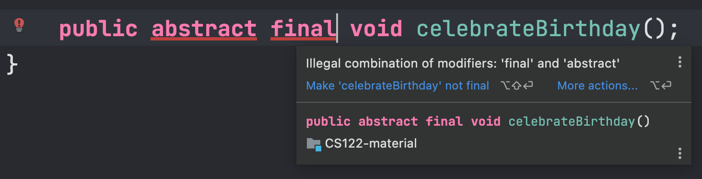
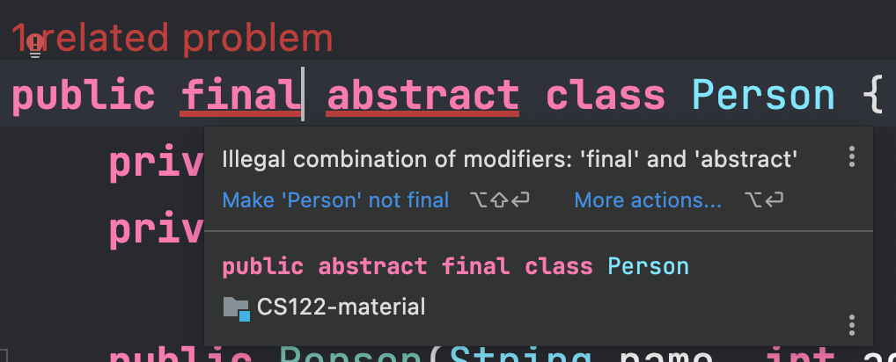

## Lecture 03

# Interfaces

***Song of the day***: _[**This Hell**](https://youtu.be/vapT7WBkBdY) by Rina Sawayama (2022)._

---

### Sections

1. [**Lab Exercise**](#part-4-lab-exercise)
2. [**Overloading vs Overriding**](#part-1-overloading-vs-overriding)
3. [**Issues with Inheritance**](#part-2-issues-with-inheritance)
4. [**Interfaces**](#part-3-interfaces)
5. [**On your first homework assignment**](#part-5-on-your-first-homework-assignment)

### Part 0: _Lab Exercise_

_Due Friday, June 10th, 11:59pm on Classes_

1. Define an abstract class, `Sport`, with at least two attributes (variables) and one method, representing the general 
structure of real sports. These attributes and method can be whatever you want them to be, but keep in mind that they
need to follow the principles of encapsulation and visibility as closely as possible. _(5pts)_

2. Define one concrete subclass of the `Sport` superclass. This subclass must define at least one new attribute and
one new method. The same requirements for encapsulation and visibility requirements apply as in step 1. _(5pts)_

Additional requirements:
- Methods of the `Sport` class must only be available to its subclasses.
- All attributes of both classes must be immutable (i.e. they cannot be changed after they are assigned a value).
- **Due at 11:59pm, 6/10**. Late assignments will receive a 2pt penalty per day late. Last day to submit is Monday, 6/13.
- Your submission must be a ***zipped*** folder of the following structure:

```text
[lastName_firstName_lab01]
    |
    |-- Sport.java
    |-- YourSportConcreteClass.java (don't actually name it this lol)
    |-- YouExtraCreditClass.java (see below)
```

For potential extra points (not required):
- Define a second concrete subclass of the `Sport` superclass following the same requirements as the first one.

Since this is our first lab, I won't grade too harshly at all. Just try to meet the basic requirements, and ask me as
many questions as you want!

### Part 1: _Overloading vs Overriding_

Just a quick aside on the terms "overloading" and "overriding," since they are easily mixed up.

Overriding, as we saw during our [**previous 
lecture**](https://github.com/sebastianromerocruz/CS122-material/tree/main/src/overridingMethodsAndAbstract#part-2-when-overriding-methods-in-java), 
deals with two methods, one in a parent class and one in a child class, that have the same signature but may have 
different behaviour.

When we refer to overloading, we are referring to **creating multiple methods within the same class that share the same
name, but accept a different set of parameters.**

For example, let's say that you had a class that simulated a [**Nintendo 
64**](https://en.wikipedia.org/wiki/Nintendo_64) video game console:

```java
package interfaces.overloadingVsOverriding;

public class Nintendo64 {
    public static final int DEFAULT_NUMBER_OF_PLAYERS = 1;

    private final String currentCartridge;
    private final int numberOfControllers;

    public Nintendo64(String currentCartridge, int numberOfControllers) {
        this.currentCartridge = currentCartridge;
        this.numberOfControllers = numberOfControllers;
    }

    // Getters below...
}
```

<sub>**Code block 1**: A simple class called `Nintendo64` with one public static attribute `DEFAULT_NUMBER_OF_PLAYERS`
and two private attributes—`currentCartridge` and `numberOfControllers`.</sub>

Here, the user would _have to_ provide values for both private attributes in order to instantiate objects of the 
`Nintendo64` class:

```java
Nintendo64 myNintendo64 = new Nintendo64("Super Smash Bros.", 3);
```

But what if we wanted the user to have the ability to instantiate `Nintendo64` objects by just providing the name of the
cartridge? Or maybe even by providing no information at all? Video game consoles can exist without game cartridges and
controllers, so this seems like reasonable behaviour.

To achieve this, we can **overload our constructor method** to accommodate for these different possibilities:

```java
package interfaces.overloadingVsOverriding;

public class Nintendo64 {
    public static final int DEFAULT_NUMBER_OF_PLAYERS = 1;
    public static final String NO_CARTRIDGE = null;

    private final String currentCartridge;
    private final int numberOfControllers;

    /**
     * Does the user have a cartridge AND a specific number of players?
     * */
    public Nintendo64(String currentCartridge, int numberOfControllers) {
        this.currentCartridge = currentCartridge;
        this.numberOfControllers = numberOfControllers;
    }
    
    /**
     * Does the user only specify the cartridge name? In that case, overload
     * the constructor with this one:
     * */
    public Nintendo64(String currentCartridge) {
        // In this case, it is up to us to handle the numberOfControllers attribute
        this(currentCartridge, DEFAULT_NUMBER_OF_PLAYERS);
    }
    
    /**
     * What is the player provides us with no information at all when creating an
     * object of this class? We, yet again, overload:
     * */
    public Nintendo64() {
        this(NO_CARTRIDGE, DEFAULT_NUMBER_OF_PLAYERS);
    }

    // Getters below...
}
```

<sub>**Code block 2**: Our `Nintendo64` class with three different constructors. In other words, our constructor was
overloaded twice.</sub>

This way, all the [**following instantiations**](overloadingVsOverriding/Nintendo64.java) of `Nintendo64` objects are 
valid:

```java
Nintendo64 myNintendo64 = new Nintendo64("Super Smash Bros.", 3);
Nintendo64 yourNintendo64 = new Nintendo64("The Legend of Zelda: Ocarina of Time");
Nintendo64 theirNintendo64 = new Nintendo64();
```

### Part 2: _Issues with Inheritance_

One subtle issue that may not be immediately obvious about inheritance is related to visibility. By this, we mean the
ability of a class to access its members—whether they belong to them or to their parent class. 

Remember that **all attributes and methods of a parent class, even those that are private, are inherited by its 
children.** This can cause problems because, while private members cannot be accessed directly by a class's children,
**they can be accessed, and thus modified, indirectly**. Consider the following simple example:

```java
public abstract class Person {
    private final String name;
    private int age;

    protected Person(String name, int age) {
        this.name = name;
        this.age = age;
    }

    protected void celebrateBirthday() {
        System.out.printf("Happy birthday, %s! You are now %d", name, ++age);
    }
}
```

<sub>**Code Block 3**: A simple [**abstract class**](visibility/Person.java) with two private attributes—`name` and
`age`.</sub>

By giving the `private` modifier, we as programmers intend for our two attributes to only be accessible—and 
modifiable—to the `Person` class **only**. Consider, though, a subclass of our `Person` class:

```java
public class Programmer extends Person {
    private final String favouriteProgrammingLanguage;

    public Programmer(String name, int age, String favouriteProgrammingLanguage) {
        super(name, age);
        this.favouriteProgrammingLanguage = favouriteProgrammingLanguage;
    }
}
```

<sub>**Code Block 4**: A subclass to the `Person` class.</sub>

While a programmer object would not be able to do, say, the following:

```java
Programmer sebastian = new Programmer("Sebastián", 29, "Java");

sebastian.age++;
```

It _would_ be able to increase the value of `age` **indirectly** by calling the perfectly public `celebrateBirthday()` 
method.

```java
Programmer sebastian = new Programmer("Sebastián", 29, "Java");

sebastian.celebrateBirthday();
```

<sub>**Code Block 5**: An [**indirect mutation**](visibility/Programmer.java) of the `age` attribute.</sub>

By the principles of encapsulation, this is bad design, but it's not necessarily unfixable. It makes sense for 
`Programmer` objects to also age, so making `age` a `protected` attribute (instead of `private`) might be a better 
choice. Or, if we really don't want `age` to change, we can make it `final`.

Just keep in mind that, while attributes of an abstract class can be final, neither an abstract method nor an abstract
class can be declared as `final`:




<sub>**Figure 1**: IntelliJ yelling at me for making an abstract method and an abstract class final.</sub>

### Part 3: _Interfaces_

One While abstract classes solve a lot of OOP's code-reusability issues, Java allows to go even further with it.

For example, what if you knew that you wanted your classes behave a certain way, but you didn't want to define a
default way for them to behave? For example, let's say we had a `MusicalInstrument` abstract class with a `play()` 
method:

```java
public abstract class MusicalInstrument {
    public void play() {
        // What happens here?
    }
}
```

This is fine, but unless you make the `play()` method abstract as well, you _have_ to give it some functionality. But
how does an abstract musical instrument play? Do you strum an oboe? Do you drum on a harp? Ideally, we would like to
leave this implementation to the actual concrete classes. How can we do this without writing the word `abstract` a
billion times over? Enter: interfaces.

```java
public interface MusicalInstrument {
    public void play();
}
```

<sub>**Code Block 6**: Our [**first interface**](interfaces/MusicalInstrument.java).</sub>

Interfaces are sometimes thought of as "contracts". By writing a `MusicalInstrument` contract, we are telling all 
classes that subscribe to that contract that, eventually, they will ***have*** to define functionality for a `public 
void play()` method.

The way we have a class abide by a certain interface is by using the `implements` keyword:

```java
public class CorAnglais implements MusicalInstrument {
    private final String reedMaterial;

    public CorAnglais(String reedMaterial) {
        this.reedMaterial = reedMaterial;
    }

    @Override
    public void play() {
        System.out.printf("Our Cor Anglais is playing with a %s reed.", reedMaterial);
    }
}
```

<sub>**Code Block 7**: A concrete class implementing the `MusicalInstrument` interface.</sub>

You might be wondering how this might further differ from abstract classes, and the answer is that a class **can
implement more than one interface**. For example, let's say we created an abstract class for stringed instruments:

```java
public abstract class StringedInstrument implements MusicalInstrument {
    private final int numberOfStrings;

    protected StringedInstrument(int numberOfStrings) {
        this.numberOfStrings = numberOfStrings;
    }

    protected int getNumberOfStrings() {
        return numberOfStrings;
    }
}
```

<sub>**Code Block 7**: An abstract class implementing the `MusicalInstrument` interface. Notice that, since it is not
concrete, the Java compiler will not require us to define functionality for the `play()` method yet.</sub>

Now, let's say we wanted an `ElectricBassGuitar` concrete class. This class will likely inherit from 
`StringedInstrument`, but since it is also an electrical appliance, we might want to keep track of its voltage as well.

What if the following interface existed?

```java
public interface ElectricalAppliance {
    double voltage = 90.0d;  // default voltage of every electrical appliance object

    public double getElectricalCurrent(double resistance);
}
```

<sub>**Code Block 8**: An interface with an attribute and a method.</sub>

Our electric [**bass guitar class**](interfaces/ElectricBassGuitar.java) would thus look like this:

```java
public class ElectricBassGuitar extends StringedInstrument implements ElectricalAppliance {
    private final String brand;

    public static void main(String[] args) {
        double amplifierResistance = 100.50;
        ElectricBassGuitar rickenbacker4001 = new ElectricBassGuitar(4, "Rickenbacker");

        rickenbacker4001.play();

        System.out.printf("The electric current running through our amplifier is of about %.2f volts.\n",
                rickenbacker4001.getElectricalCurrent(amplifierResistance));
    }

    public ElectricBassGuitar(int numberOfStrings, String brand) {
        super(numberOfStrings);
        this.brand = brand;
    }

    @Override
    public double getElectricalCurrent(double resistance) {
        return voltage / resistance;
    }

    @Override
    public void play() {
        System.out.printf(
                "Playing our %s %d-string electric bass guitar with a voltage of %.2f amps!\n",
                brand, super.getNumberOfStrings(), voltage
        );
    }
}
```

<sub>**Code Block 9**: Since we inherit from `StringInstrument` (which itself implements `MusicalInstrument`) and 
because we implement `ElectricalAppliance`, we need to define its methods.</sub>

### Part 4: _On your first homework assignment_

I will release your first homework assignment on Saturday (6/11) morning, and it will be due next Saturday (6/18) at 
11:59pm. The prompt will be released as a PDF on classes, and will be submitted through classes in the same exact way as
the labs. 

Please don't hesitate to email me or schedule office hours if you have any questions throughout the 
weekend/week!