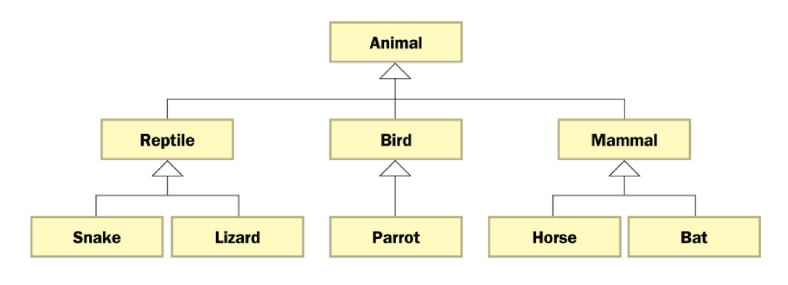
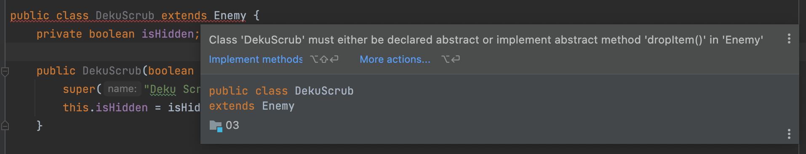

## Lecture 02

# Inheritance: _Overriding Methods and Abstract Classes_

***Song of the day***: _[**Mermaid in Lisbon (feat. Teresa Salgueiro)**](https://youtu.be/b_0Nqhf_aM0) by Patrick Watson (2021)._

---

### Part 1: _Overriding Methods_

Last time, we spoke about our newfound ability to reuse code via inheritance, but it doesn't stop there. Not only can
we use our parent class's methods in our child class, but we also can _modify_ (or _override_) the actual behavior or
the method. For example, consider our `Enemy` class's `attack()` method:

```java
public class Enemy {
    //**
    // Some code here...
    // */
    
    public float attack() {
        return (float) attackPower / healthPoints;
    }
    
    //*
    // More code here...
    // */
}
```

This method makes use of two attributes that every object of, or deriving from, the `Enemy` class has: `attackPower` and
`healthPoints`. But what if we wanted a subclass of `Enemy` to have a different attack mechanism, perhaps based on 
behaviour only present in that subclass? Consider this `Lizalfos` class, another enemy in our suite:

```java
package Enemies;

public class Lizalfos extends Enemy {
    private final int numberOfLives;

    public Lizalfos(int numberOfLives) {
        super("Lizalfos", 100, "Sword", 50);
        this.numberOfLives = numberOfLives;
    }

    public int getNumberOfLives() {
        return numberOfLives;
    }
}
```

As you can see, `Lizafos` objects have the `numberOfLives` attribute available to them. Let's say that this attribute,
an `int`, represents the number of times that these enemies have to be "slayed" in order to stay down for good, 
Sekiro-style. What if we wanted the number of lives to factor into how much attack power `attack()` returns? Perhaps
using the following formula:

```text
power = (attack / health) * (1 + (1 / lives))
```

In other words, the attack power will get smaller the more lives this Lizalfos has.

Currently, `attack()` only takes advantage of `attackPower` and `healthPoints`, but by using the following syntax, we 
can override that behaviour:

```java
package Enemies;

public class Lizalfos extends Enemy {
    private final int numberOfLives;

    public Lizalfos(int numberOfLives) {
        super("Lizalfos", 100, "Sword", 50);
        this.numberOfLives = numberOfLives;
    }

    @Override
    public float attack() {
        return (float) (((float) super.getAttackPower() / (float) super.getHealthPoints()) * (1.0 + 1.0 / (float) getNumberOfLives()));
    }

    public int getNumberOfLives() {
        return numberOfLives;
    }
}
```

Perfect. Now, our `Lizalfos` objects' `attack()` power will differ depending on the number of lives that they have!

```java
import Enemies.Lizalfos;

public class Game {
    //**
    // A simple demonstration of how our Lizalfos' power differs depending on their respective number of lives
    // */
    public static void main(String[] args) {
        Lizalfos lizalfosOne = new Lizalfos(1);
        Lizalfos lizalfosTwo = new Lizalfos(5);
        Lizalfos lizalfosThree = new Lizalfos(10);

        System.out.printf(
                "These %s will have attack powers of  %.2f, %.2f, and %.2f, respectively.",
                lizalfosOne.getName(),
                lizalfosOne.attack(), lizalfosTwo.attack(), lizalfosThree.attack()
        );
    }
}
```

Output:

```text
These Lizalfos will have attack powers of  1.00, 0.60, and 0.55, respectively.
```

So, why would we choose to modify methods when we can simply just define new methods for each of our subclasses? Well
the whole point of inheritance is ***code reuse***, right? If we have the ability to reuse a parent's method, changing
it along if necessary, then this, by definition, is code reuse. Otherwise we'll end up with an `attackDekuScrub()`, 
`attackLizalfos()`, `attackDodongo()`, etc.—one for each of our enemies—very clearly a messy affair.

### Part 2: _When Overriding Methods in Java..._

When overriding methods in Java, there are a couple of things you should be aware of:

- When overriding methods, the child method **must have the _same signature_ as the parent's method**. This is to say
that, for example, the `Lizalfos`'s `attack()` method ***must*** be public and it ***must*** return a float value,
since that is the way `attack()` was defined in the parent class, `Enemy`.
- If, for whatever reason, you want to use the parent class's definition of the overridden method, you can use the
`super` keyword. Keep in mind that `super` can only be used inside the child class's definition:

```java
package Enemies;

public class Lizalfos extends Enemy {
    //** Some code here...*/

    // Overridden attack() method
    @Override
    public float attack() {
        return (float) (((float) super.getAttackPower() / (float) super.getHealthPoints()) * (1.0 + 1.0 / (float) getNumberOfLives()));
    }

    // The parent class's attack() method
    public float basicAttack() {
        return super.attack();
    }
    
    //** More code here...*/
}
```

- Every method in a parent class can be overridden, **unless the method is declared with the `final` modifier**.
- Technically, you can also override attributes (data). This is called shadowing, and it should be avoided as it
tends to cause unnecessarily confusing code.

Check out the entire implementation for the `Lizalfos` class [**here**](src/Enemies/Lizalfos.java).

### Part 2: _Class Hierarchies_

Just like generations of children grow and have children themselves, classes that extend from a parent class can also
be extended by a parent class themselves. In our enemy context, this would be useful if we didn't just have one type
of Lizalfos, but several, each with their own, unique behaviour:

```java
class BlueLizalfos extends Lizalfos {
    //** Implementation here...*/
}
```
```java
class RedLizalfos extends Lizalfos {
    //** Implementation here...*/
}
```
```java
class GreenLizalfos extends Lizalfos {
    //** Implementation here...*/
}
```

At this point, we're forming more of what is called a **class hierarchy**:



<sub>_**Figure 1**: Class Hierarchy Diagram. Two children of the same parent are called **siblings**._</sub>

When designing class hierarchies for your programs, a good heuristic to follow is that common features should be put as
high in the hierarchy as is reasonable. This way, you define a common feature only one at a proper level, as opposed to
multiple times at a lower level.

Child classes inherit from **all of its ancestor classes**; a `BlueLizalfos` object will be able to do everything a 
`Lizalfos` object can do, and therefore everything an `Enemy` object can do.

We have actually be using inheritance from the beginning, without even realising it. In Java, **all classes are derived
from a common parent, called the `Object` class**, who resides in the `java.lang` package of the standard class library.
In fact, if a class is not explicitly defined to be the child of an existing class, it is automatically assumed to be 
the child of the `Object` class. Regardless of how deep the hierarchy tree extends, though, `Object` will remain the
ultimate root, as the original parent class will, by default, extend the `Object` class.

The `Object` class contains a few useful methods, such as `toString()`. By default, this method will return a string 
that contains the name of the object's class along with its location in memory:

```java
Lizalfos lizalfos = new Lizalfos(1);

System.out.printf("%s\n", lizalfos.toString());
```

Output:

```text
Enemies.Lizalfos@7a81197d
```

This is not a very helpful representation of a Lizalfos, so let's override `toString()`'s behaviour:

```java
package Enemies;

public class Lizalfos extends Enemy {
    //** Some code here...*/

    @Override
    public String toString() {
        return new StringBuilder(getName() + " object with " + getNumberOfLives() + " number of lives.").toString();
    }
    
    //** More code here...*/
}
```

If we print the same `Lizalfos` object now:

```text
Lizalfos object with 1 number of lives.
```

---

Another useful method that the `Object` class defines for us is the `equals` method. By default, it returns `true` if
two ***references are aliases of each other***. This is to say, if they exist in the same place in the machine's memory.

This means that two objects can have the exact same attribute values, but the `equals` method would still return `false`
because they don't exist in the same place in memory:

```java
package Geography;

public class Coordinates {
    private final double latitude;
    private final double longitude;

    public static void main(String args[]) {
        Coordinates pointA = new Coordinates(34.5d, 40.0d);
        Coordinates pointB = new Coordinates(34.5d, 40.0d);

        System.out.println(pointA == pointB);
    }

    public Coordinates(double latitude, double longitude) {
        this.latitude = latitude;
        this.longitude = longitude;
    }
}
```

Ouput

```text
false
```

We can actually override `equals()`'s behaviour as well. Different objects will equal each other under different 
circumstances (i.e. are two `MiniCooperClubman` objects with identical attributes but different license plate numbers
equal to each other?), and you can decide when this is the case:

```java
package Geography;

public class Coordinates {
    private final double latitude;
    private final double longitude;

    public static void main(String args[]) {
        Coordinates pointA = new Coordinates(34.5d, 40.0d);
        Coordinates pointB = new Coordinates(34.5d, 40.0d);

        System.out.println(pointA.equals(pointB));
    }

    public Coordinates(double latitude, double longitude) {
        this.latitude = latitude;
        this.longitude = longitude;
    }

    public double getLongitude() {
        return longitude;
    }

    public double getLatitude() {
        return latitude;
    }

    @Override
    public boolean equals(Object o) {
        // Check if the Object instance o exists and is of the same class.
        if (o == null || getClass() != o.getClass()) {
            return false;
        }
        
        // If none of these are a problem, let's make 2 Coordinate objects equal if their lats and longs are equal
        return ((Coordinates) o).getLatitude() == getLatitude() && ((Coordinates) o).getLongitude() == getLongitude();
    }
}
```

Output:

```text
true
```

### Part 3: _Abstract Classes_

Our enemy system is looking pretty good, but there is something that doesn't quite make sense here. We know that all
classes extending from the `Enemy` class will be enemies, but what would happen if somebody in our team created an 
object of the `Enemy` class itself?

If this object a Deku Scrub? Is it a Lizalfos? A Poe? It is none of those—it is simple an...enemy. To see why this is a
problem, take a look at the class hierarchy in figure 1. We know pretty well how a snake, lizard, parrot, horse, and bat
would look like, yes? But how, exactly, does a "reptile" look like? What about a "bird", or a "mammal"? Even worse: 
how would you describe an "animal", physically? You've probably deduced by now that these classes can't exist by 
themselves, since they are simply too abstract to make sense as objects—just as in real life.

Java takes this problem into account, and gives us a wonderful modifier that tells the compiler not to allow the 
instantiation of any objects of this class—only allow other classes to extend from it: the `abstract` keyword:

```java
package Enemies;

public abstract class Enemy {
    private final String name;
    private final int healthPoints;
    private final String weaponName;
    private final int attackPower;

    public static void main(String[] args) {
        Enemy enemy = new Enemy("Deku Scrub", 100, "Deku Seeds", 20);

        System.out.printf("%s is attacking with %.2f power!", enemy.getName(), enemy.attack());
    }

    public float attack() {
        return (float) attackPower / healthPoints;
    }

    public int getAttackPower() {
        return this.attackPower;
    }

    public int getHealthPoints() {
        return healthPoints;
    }

    public String getName() {
        return name;
    }

    public String getWeaponName() {
        return weaponName;
    }
}
```

The cool thing about abstract classes is that you don't actually have to define the behaviour of its methods—leave that
to its child classes:

```java
package Enemies;

public abstract class Enemy {
    //** Some code here...*/

    // Leave the implementation up to the child classes
    public abstract String dropItem();
    
    //** More code here...*/
}
```

As soon as we do this, Java will complain—specifically, when it comes to `Enemy`'s child classes:



<sub>_**Figure 2**: Java won't let us compile until we've "concretised" every abstract method._</sub>

Let's fix this by putting a list of items every enemy can drop:

```java
package Enemies;

public abstract class Enemy {
    //** Some code here...*/
    
    public static final String[] items = {
            "Deku Stick",
            "Heart",
            "Potion"
    };

    //** More code here...*/
}
```

And implementing the `dropItem()` method for both `DekuScrub` and `Lizalfos`:

```java
package Enemies;

public class DekuScrub extends Enemy {
    //** Some code here...*/

    private static final int DEKU_NUT_INDEX = 0;

    //** More code here...*/

    @Override
    public String dropItem() {
        // Drop a deku nut only
        return Enemy.ITEMS[DEKU_NUT_INDEX];
    }
    
    //** More code here...*/
}
```
```java
package Enemies;

public class Lizalfos extends Enemy {
    //** Some code here...*/

    @Override
    public String dropItem() {
        // Let's return a random item from the 3 possibilities
        int max = Enemy.ITEMS.length;
        int min = 0;

        // See method 1: https://www.educative.io/edpresso/how-to-generate-random-numbers-in-java
        int randomIndex = (int) Math.floor(Math.random() * (max - min + 1) + min);

        return Enemy.ITEMS[randomIndex];
    }

    //** More code here...*/
}
```

Let's see it in action:

```java
import Enemies.DekuScrub;
import Enemies.Lizalfos;

public class Game {
    public static void main(String[] args) {
        Lizalfos lizalfos = new Lizalfos(1);

        DekuScrub dekuScrub = new DekuScrub(false);

        System.out.printf("%s dropped a %s!\n", lizalfos.getName(), lizalfos.dropItem());
        System.out.printf("%s dropped a %s!\n", dekuScrub.getName(), dekuScrub.dropItem());
    }
}
```

Possible output (since we use random behaviour):

```text
Lizalfos dropped a Potion!
Deku Scrub dropped a Deku Stick!
```