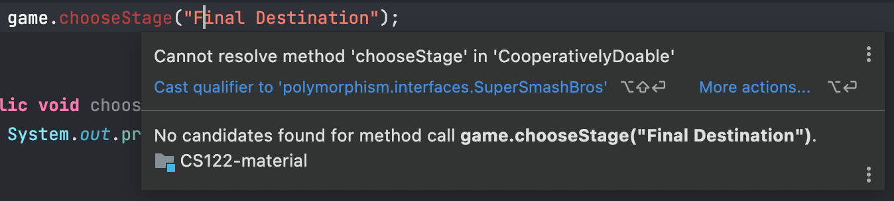
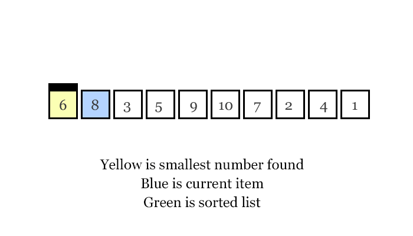

## Lecture 05

# Polymorphism: The Interface Perspective, Sorting, and Searching

### 28 Prairial, Year CCXXX

***Song of the day***: _[**ミラクルすぎてヤバイ**](https://youtu.be/puaOtCox2CI) by Hige Driver feat. Shully (2014)._

### Sections

1. [**Polymorphism via inheritance**](#part-1-polymorphism-via-inheritance)

### Part 1: _Polymorphism via inheritance_

We spoke about the effects and value of polymorphism through the lens of inheritance, but polymorphic references can be
set up via interfaces as well. Since interfaces can be pretty removed from the concrete classes that implement it, this
can allow for some pretty cool behaviour. Suppose we have an interface called `CooperativelyDoable` that represents
things in real life that can be physically done with other people:

```java
public interface CooperativelyDoable {
    public void addParticipant(String participantName);
    public void begin();
}
```

<sub>**Code Block 1**: A pretty general [**interface**](CooperativelyDoable.java).</sub>

Now, check out the following [**two**](SuperSmashBros.java) [**sublasses**](UnitedNationsGeneralAssembly.java):

```java
// SuperSmashBros.java
public class SuperSmashBros implements CooperativelyDoable {

    public void chooseStage(String stageName) {
        System.out.printf("Stage %s chosen!", stageName);
    }

    @Override
    public void addParticipant(String participantName) {
        System.out.printf("Adding character %s to the roster.", participantName);
    }

    @Override
    public void begin() {
        System.out.println("FIGHT!");
    }
}
```
```java
// UnitedNationsGeneralAssembly.java
public class UnitedNationsGeneralAssembly implements CooperativelyDoable {

    public void createCommittee(String committeeName) {
        System.out.printf("Creating the %s...", committeeName);
    }

    @Override
    public void addParticipant(String participantName) {
        System.out.println("Ratifying %s's application to the UN...");
    }

    @Override
    public void begin() {
        System.out.println("DIPLOMACY!");
    }
}
```

<sub>**Code Blocks 2 & 3**: Two radically different subclasses.</sub>

Can we form polymorphic references using `CooperativelyDoable`? It turns out, incredibly, that we can:

```java
CooperativelyDoable meeting = new UnitedNationsGeneralAssembly();
CooperativelyDoable game = new SuperSmashBros();
```

Unsurprisingle, we're pretty limited in functionality when we do this:



<sub>**Figure 1**: Remember—late binding.</sub>

Though, of course, you can avoid doing this by casting:

```java
((SuperSmashBros) game).chooseStage("Final Destination");
```

<sub>**Code Blocks 4**: Casting a `CooperativelyDoable` reference to a `SuperSmashBros` one. This is totally 
valid.</sub>

### Part 2: _Sorting with Interfaces_

There's a pretty neat algorithm called selection sort, whereby you sort elements in a list/array using the following
algorithm:

1. Find the smallest value in the list
2. Switch it with the value in the first position
3. Find the next smallest value in the list
4. Switch it with the value in the second position
5. Repeat until all values are in their proper places



<sub>**Figure 2**: A nice animation of selection sort.</sub>

This algorithm is known for being pretty simple to grasp, but also very inefficient (it is **O(n<sup>2</sup>)**). Still,
for our purposes, it is perfect. Let's say we have our coordinate class from earlier in the semester:

```java
public class Coordinates {
    private final double latitude;
    private final double longitude;

    public static void main(String[] args) {
        Coordinates pointA = new Coordinates(34.5d, 40.0d);
        Coordinates pointB = new Coordinates(34.5d, 40.0d);

        System.out.println(pointA.equals(pointB));
    }

    public Coordinates(double latitude, double longitude) {
        this.latitude = latitude;
        this.longitude = longitude;
    }

    public double getLongitude() {
        return longitude;
    }

    public double getLatitude() {
        return latitude;
    }

    @Override
    public boolean equals(Object o) {
        // Check if the Object instance o exists and is of the same class.
        if (o == null || getClass() != o.getClass()) {
            return false;
        }

        return ((Coordinates) o).getLatitude() == getLatitude() && ((Coordinates) o).getLongitude() == getLongitude();
    }
}
```

How do we sort coordinate objects? Integers are easy—there is only one value to sort. But we can't very well ask Java
to arbitrarily pick which of our two values it should sort by. It would be pretty convenient if there was an interface,
like `CooperativelyDoable`, that was instead something like—I don't know—`Comparable`. Oh wait, there is one:

```java
package polymorphism.interfaces;

import java.lang.Comparable;

// Notice the way we put the classname inside the <> operator of the Comparable interface
public class Coordinates implements Comparable<Coordinates> {
    private final double latitude;
    private final double longitude;

    public Coordinates(double latitude, double longitude) {
        this.latitude = latitude;
        this.longitude = longitude;
    }

    @Override
    public int compareTo(Coordinates o) {
        // Here, we are asking Java to compare the string versions of our objects. If this is larger, this will return
        // 1. If it is smaller, it will return 0. Arrays.sort() uses these values with algorithms like selection sort
        // in order to actually sort.
        return toString().compareTo(o.toString());
    }

    @Override
    public String toString() {
        return "(%.2f, %.2f)".formatted(latitude, longitude);
    }
}
```

If we then created an array of random coordinates, and sorted them with `Arrays.sort()`:

```java
Coordinates[] coordinates = {
        new Coordinates(Math.random(), Math.random()),
        new Coordinates(Math.random(), Math.random()),
        new Coordinates(Math.random(), Math.random()),
        new Coordinates(Math.random(), Math.random()),
        new Coordinates(Math.random(), Math.random()),
        new Coordinates(Math.random(), Math.random()),
};

// Before sorting
for (Coordinates cooordinate: coordinates) {
    System.out.println(cooordinate);
}

System.out.println();

Arrays.sort(coordinates);

// After sorting
for (Coordinates cooordinate: coordinates) {
    System.out.println(cooordinate);
}
```

Output:

```text
(0.67, 0.09)
(0.65, 0.47)
(0.31, 0.87)
(0.26, 0.71)
(0.64, 0.71)
(0.32, 0.93)

(0.26, 0.71)
(0.31, 0.87)
(0.32, 0.93)
(0.64, 0.71)
(0.65, 0.47)
(0.67, 0.09)
```

### Part 3: _Lab 03_

Consider the following abstract class and interface, based on [**Napoleon's army**], widely acknowledged to be one of 
the greatest fighting forces ever assembled in history:

```java
// GrandArmyForce.java
public abstract class GrandArmyForce {
    private final int numberOfActiveMembers;
    
    public void attack() {
        System.out.printf("%s soldiers are attacking!");
    }
}

// NeedsAnimals.java
public interface NeedsAnimals {
    public void feedAnimals();
}
```

Define one concrete classe that inherits from `GrandArmyForce` and one concrete class that both inherits from
`GrandArmyForce` and implements `NeedsAnimals`. If done correctly, you should be able to do the following in a 
`main()` method:

```java
GrandArmyForce[] grandArmy = {
        new OneOfYourClasses(100),
        new TheOtherOneOfYourClasses(200)
};

for (GrandArmyForce grandArmyForce : grandArmy) {
        grandArmyForce.attack()
}
```

Keep in mind that each class's implementation of `attack()` must be different based on the forces they are supposed to 
represent!