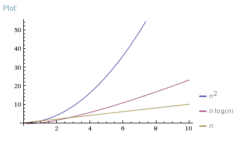
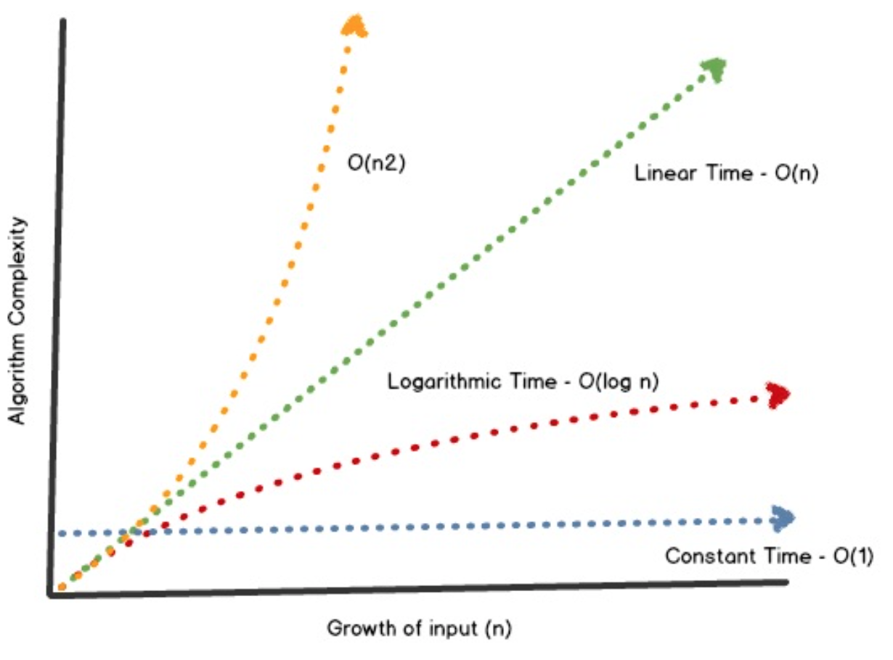

## Lecture 06

# Polymorphism: Sorting and Searching

### 8 Messidor, Year CCXXX

***Song of the day***: _[**Enti Warraks**](https://youtu.be/TcDJMyMYhNM) by Mohammad Jamal (1992)._

### Sections

1. [**Sorting our customer classes using `Comparable`**](#part-1-sorting-our-customer-classes-using-comparable)
2. [**Selection Sort**](#part-2-selection-sort)
3. [**Insertion Sort**](#part-3-insertion-sort)
4. [**Binary Search**](#part-4-binary-search)
5. [**Lab 03**](#part-5-lab-03)

### Part 1: _Sorting our customer classes using `Comparable`_

We learned last class that we can adapt our classes to be sortable (i.e. put in some kind of order) by having your class
implement the `Comparable` interface. Let's check out a simple class representing a country:

```java
public class Country implements Comparable<Country> {

    private final String stateName;
    private final int startYear;
    private final String continent;

    public Country(String stateName, int startYear, String continent) {
        this.stateName = stateName;
        this.startYear = startYear;
        this.continent = continent;
    }

    // INHERITED FROM THE Object CLASS...
    @Override
    public boolean equals(Object o) {
        if (o == null || !this.getClass().equals(o.getClass())) {
            return false;
        }

        return continent.equals(((Country)o).continent) &&
                startYear == ((Country)o).startYear &&
                stateName.equals(((Country)o).stateName);
    }

    @Override
    public String toString() {
        return "%s, %s: %d".formatted(stateName, continent, startYear);
    }

    // ACCESSIBLE VIA THE Comparable INTERFACE...
    @Override
    public int compareTo(Country o) {
        return Integer.compare(startYear, o.startYear);
    }
}
```

<sub>**Code Block 1**: Our [**`Country` class**](Country.java). Notice that we have to specify that `Country` objects 
will be comparable with only other `Country` objects via extending `Comparable<Country>`.</sub>

Here, I overrode the `Object` class's `equals()` method to return `true` if and only if both objects' `stateName`,
`startYear`, and `continent` attributes are also equal. This completes half of our problem; if we know how `Country`
objects act when they are equal to each other, how should they act in relation to each other if they are _not_ equal?

This is where the `Comparable` interface comes in. I can basically do whatever I want here, but to simplify things, I 
told Java to only consider the countries' founding year (`startYear`) when comparing two `Country` objects.

Using the `Arrays` class's `sort()` method, we can see it at work:

```java
// Create a few Country objects and put them in an array...
Country france = new Country("France",1958, "Europe");
Country japan = new Country("Japan", 1947, "Asia");
Country portugal = new Country("Portugal", 1976, "Europe");
Country algeria = new Country("Algeria", 1962, "Africa");
Country mexico = new Country("Mexico", 1917, "North America");

Country[] countries = new Country[] {
        portugal, japan, mexico, france, algeria
};

// Print contents before sorting...
for (Country country : countries) {
    System.out.println("-> " + country);
}

// Sort...
Arrays.sort(countries);
System.out.println();  // for nice formatting

// Print contents after sorting...
for (Country country : countries) {
    System.out.println("-> " + country);
}
```

Output:

```text
-> Portugal, Europe: 1976
-> Japan, Asia: 1947
-> Mexico, North America: 1917
-> France, Europe: 1958
-> Algeria, Africa: 1962

-> Mexico, North America: 1917
-> Japan, Asia: 1947
-> France, Europe: 1958
-> Algeria, Africa: 1962
-> Portugal, Europe: 1976
```

Awesome. But how does this sorting actually work under the hood? Java's `Arrays.sort()` method uses a rather fast
algorithm to do this, but we'll start with slightly simpler, less effective ones to get a feel for how polymorphism 
plays the lead role here.

### Part 2: _Selection Sort_

I'm going to make our sorters public abstract methods of a single class, so that we can keep them in one place, and so 
we can access the methods without creating `Comparer` objects. Let's call this class `Comparer`:

```java
public class Comparer {
    public static void selectionSort(Comparable[] list) {
        // Sorting...
    }
}
```

Recall the steps for selections sort:

1. Find the smallest value in the list
2. Switch it with the value in the first position
3. Find the next smallest value in the list
4. Switch it with the value in the second position
5. Repeat until all values are in their proper places


<sub>**Figure 1**: A nice animation of selection sort.</sub>

The way we program this is as follows:

```java
public class Comparer {
    public static void selectionSort(Comparable[] list) {
        int indexOfMinimum;
        Comparable temp;
        
        // 5. Repeat until all values are in their proper places
        for (int index = 0; index < list.length - 1; index++) {
            // 1. Find the smallest value in the list
            indexOfMinimum = index;
            for (int scannerIndex = index + 1; scannerIndex < list.length; scannerIndex++) {
                if (list[scannerIndex].compareTo(list[indexOfMinimum]) < 0) {
                    indexOfMinimum = scannerIndex;
                }
            }

            // 3. Find the next smallest value in the list
            temp = list[indexOfMinimum];
            
            // 4. Switch it with the value in the second position
            list[indexOfMinimum] = list[index];
            list[index] = temp;

            System.out.println();
        }
    }
}
```

<sub>**Code Block 2**: An implementation of `selectionSort()`.</sub>

The keys here are lines like `Comparable[] list` and `Comparable temp;`. Java does not know, and does not care, what 
kind of `Comparable` class we are dealing with here—**it knows that, because we implemented the `Comparable` class, we
will be able to work with them in `selectionSort()`. Let's see it in action with our `Country` objects:

```java
// Create a few Country objects and put them in an array...
Country france = new Country("France", 1958, "Europe");
Country japan = new Country("Japan", 1947, "Asia");
Country portugal = new Country("Portugal", 1976, "Europe");
Country algeria = new Country("Algeria", 1962, "Africa");
Country mexico = new Country("Mexico", 1917, "North America");

Country[] countries = new Country[] {
        portugal, japan, mexico, france, algeria
};

// Print contents before sorting...
for (Country country : countries) {
    System.out.println("-> " + country);
}

// Sort...
Comparer.selectionSort(countries);
System.out.println();  // for nice formatting

// Print contents after sorting...
for (Country country : countries) {
    System.out.println("-> " + country);
}
```

Output:

```text
-> Portugal, Europe: 1976
-> Japan, Asia: 1947
-> Mexico, North America: 1917
-> France, Europe: 1958
-> Algeria, Africa: 1962

-> Mexico, North America: 1917
-> Japan, Asia: 1947
-> France, Europe: 1958
-> Algeria, Africa: 1962
-> Portugal, Europe: 1976
```

And we got it. This algorithm would work with quite literally **any class that implemented the `Comparable` interface
(so long as you define the `equals()` method, of course. But you should be doing that for _all_ of your classes.)

### Part 3: _Insertion Sort_

You may or may not be aware of this, but sorting algorithms are by far some of the most discussed topics in computer
science. There are quite literally hundreds of them, and visualising them is [**very 
fun**](https://youtu.be/LOZTuMds3LM). Let's take a look at another simple one—insertion sort. The basic steps here are:

1. Consider the first item to be already sorted.
2. Insert the second item into the sorted sublist, shifting the first item to the left to make room to insert the new 
one.
3. Insert the third item into the sorted sublist (of two items), shifting items as necessary.
4. Repeat until all values are inserted into their proper positions.


<sub>**Figure 2**: A nice animation of insertion sort. Notice that the algorithm always keeps track of the current
smallest value of each pass.</sub>

We would program this in the following way:

```java
public class Comparer {
    public static void insertionSort(Comparable[] list) {
        for (int index = 1; index < list.length; index++) {
            Comparable value = list[index];
            int position = index;

            // Shift smaller values to the left while the value is smaller than the previous element
            while (position > 0 && value.compareTo(list[position - 1]) < 0) {
                list[position] = list[position - 1];
                list[position - 1] = value;
                position--;
            }

            System.out.println();
        }
    }
}
```

<sub>**Code Block 3**: An implementation of `insertionSort()`.</sub>

Again, this method has absolutely no concept of which kind of `Comparable` we're dealing with here—thanks to 
polymorphism, it doesn't need to know to do its job.

---

Both of these sorting algorithms are simple, but they are nowhere close to being the most efficient that we have 
developed. They both have outer loops that scan all elements, and inner loops that compare a value with almost all 
values in the list. So, in effect, for every single element in our list, we have to traverse the **entire** list to 
check for a smaller value. In other words, approximately _n_<sup>2</sup>-number of comparisons are made in order to sort a
list of size-_n_. We therefore say, in computer science, that these sorting algorithms are of order _n_<sup>2</sup>.

More efficient algorithms are, for example, of order _n_ log<sub>2</sub>_n_, which grows considerably slower the larger
an array is when compared to _n_<sup>2</sup>:



<sub>**Figure 3**: Time complexity of _n_, _n_ log<sub>2</sub>_n_, and _n_<sup>2</sup> algorithms.</sub>

But that, thankfully, is a story for another day.

### Part 4: _Binary Search_

The importance of sorting is not difficult to justify. For example: is it easier to find somebody's name in a list of
unordered names, or in a list of ordered names? Sorting allows for much more efficient handling of data, and finding
the optimal one is important.

But it doesn't stop at sorting. _Finding_ values in a sorted array has its fair share of attention in the programming
world. We are, generally speaking, used to using _linear search_ as human beings:


<sub>**Figure 4**: Linearly searching for the number 33 in a _sorted_ list of numbers.</sub>

The complexity of searching for a value in this way is _n_ which, as we saw in figure 3, is not terrible. But, believe
it or not, there _are_ faster ways of looking for a number in a sorted list. Specifically, it is very much possible to
achieve a log<sub>2</sub>_n_, or _logarithmic_, complexity:



<sub>**Figure 5**: The red dotted-line shows how much more efficient logarithmic algorithms are when compared to even
linear ones (green dotted-line).</sub>

---

What we are getting to here is the famed **binary search** algorithm. This goes roughly like this:

1. Examine the middle element of the list.
2. If it is the number you are looking for, then you're done.
3. If it isn't, you can limit the remaining search to either the left or the right half of the array, depending on 
whether the target number is smaller or larger than the target. For example, if the middle element of the array was 5,
and your target number was 7, then you can limit your search to the upper half of the array, since 7 cannot exist before
5 in a sorted list.
4. Repeat steps from 1-3 until you find your target. If you don't, then your target doesn't exist in the list, and 
you're done.


<sub>**Figure 6**: A nice animation comparing the speed of binary search and linear search.</sub>

The implementation is as follows:

```java
public class Comparer {
    public static Comparable binarySearch (Comparable[] list, Comparable target) {
        int lowIndex = 0, highIndex = list.length - 1, midIndex = 0;
        boolean isFound = false;

        // 4. Repeat steps from 1-3 until you find your target.
        while (!isFound && lowIndex <= highIndex) {
            // 1. Examine the middle element of the list.
            midIndex = (lowIndex + highIndex) / 2;

            if (list[midIndex].equals(target)) {
                // 2. If it is the number you are looking for, then you're done.
                isFound = true;
            } else {
                if (target.compareTo(list[midIndex]) < 0) {
                    // 3. If it isn't, you can limit the remaining search to either the left half of the array...
                    highIndex = midIndex - 1;
                } else {
                    //    ...or a the right half of the array
                    lowIndex = midIndex + 1;
                }
            }
        }

        // If you don't find the value, then your target doesn't exist in the list, and you're done.
        return isFound ? list[midIndex] : null;
    }
}
```

<sub>**Code Block 4**: An implementation of `binarySearch()`.</sub>

The signature of this method has `Comparable` all over it: We will be returning a `Comparable` object by performing
binary search on a list of `Comparable` objects, looking for a target `Comparable` object.

Again, no mention of any concrete class! Here's the full implementation

### Part 5: _Assignment 2_

Take a look at the following code:

```java
// Create two Pikachu objects
Pikachu puka   = new Pikachu("Puka", 5, "Electric");
Pikachu sparky = new Pikachu("Sparky", 5, "Electric");

// Level them both up a completely random, probably different number of levels
for (int i = 0; i < (int) (Math.random() * 100); i++) { puka.levelUp();   }
for (int j = 0; j < (int) (Math.random() * 100); j++) { sparky.levelUp(); }

// Print the name and level of the winner
System.out.printf(
    "The Pikachu with a higher level is: %s, with a level of %d!\n",
    puka == sparky ?          "Both" : (puka.compareTo(sparky) > 0 ? puka.getNickname() : sparky.getNickname()),
    puka == sparky ? puka.getLevel() : (puka.compareTo(sparky) > 0 ? puka.getLevel()    : sparky.getLevel())
);
```

<sub>**Code Block 5**: Two `Pikachu` objects being initialised, levelled up (through `levelUp()`), and compared in order
to print out the nickname and final level of the stronger one.</sub>

For this problem, `Pikachu` objects are **compared only using their _level values_ alone, and nothing else**.

`Pikachu` objects are created using three parameters: their nickname (a `String`), their current level (and `int`), and 
their type (another `String`). Here, you will find that both `Pikachu` objects `puka` and `sparky` are being compared 
for both equality (e.g. `puka == sparky`) and for inequality (e.g. `puka.compareTo(sparky) > 0`). Your job is to make 
sure that, if we ran the code in code block 5, we got a results similar to the ones below:

- _Example 1_:

```text
The Pikachu with a higher level is: Puka, with a level of 20!
```

- _Example 2_:

```text
The Pikachu with a higher level is: Sparky, with a level of 23!
```

- _Example 3_:

```text
The Pikachu with a higher level is: Sparky, with a level of 18!
```

- _Example 4_:

```text
The Pikachu with a higher level is: Puka, with a level of 9!
```

The way to do this is to modify the `Pikachu` class is similar to the way we prepared our `Country` classes to be 
sortable and searchable. Here's what it looks like right now:

```java
import java.util.concurrent.atomic.AtomicInteger;

public class Pikachu {
    private final String nickname;
    private final AtomicInteger level;
    private final String type;

    public Pikachu(String nickname, int level, String type) {
        this.nickname = nickname;
        this.level = new AtomicInteger(level);
        this.type = type;
    }

    public void levelUp() {
        level.incrementAndGet();
    }

    public String getNickname() {
        return nickname;
    }

    public int getLevel() {
        return level.get();
    }

    public String getType() {
        return type;
    }
}
```

<sub>**Code Block 6**: Our starting point.</sub>

In the [**actual file**](Pikachu.java), you will see the code contained in code block 5 contained in the `Pikachu` 
class's commented-out `main()` method. Once you have added the necessary code to make `Pikachu` objects comparable, you 
can uncomment and run the code to check if it works.

A few of things to keep in mind:
- There may be some Java types that you may not recognise. **That's totally fine**. Part of this assignment is to
be able to add to somebody else's class. All you need to worry about is making sure that `Pikachu` objects are
**comparable** to each other.
- Use `getLevel()` to access the value of `level`.
- You only need to add a few things to the `Pikachu` class in order to finish this assignment, so make sure to
ask me questions if you need to!
- Although it is not part of this problem, `Pikachu` objects must also be sortable and searchable in `Pikachu` arrays.